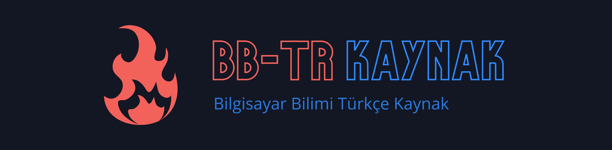

<h1 align="center">
  <a href="https://cs-space.vercel.app"></a>
</h1>

<h3 align="center">
  <a href="https://github.com/Fire-Oceann/CS-Space/issues/new?assignees=&labels=bug&template=bug_report.yml&title=">Signaler un bug</a>
  <span> · </span>
  <a href="https://github.com/Fire-Oceann/CS-Space/issues/new?assignees=&labels=feature+request&template=feature_request.yml&title=">Demander une fonctionnalité</a>
  <span> · </span>
  <a href="https://github.com/Fire-Oceann/CS-Space/discussions">Poser une question</a>
</h3>

<div align="center">
<br />
<a herf="../LICENSE"></a>
<!-- ALL-CONTRIBUTORS-BADGE:START - Do not remove or modify this section -->
<a href="https://img.shields.io/badge/all_contributors-0-orange.svg?style=for-the-badge"></a>
<!-- ALL-CONTRIBUTORS-BADGE:END -->
<a herf=".URL_"></a>
<a href="https://github.com/Fire-Oceann/CS-Space/issues"></a>

<a href="https://prettier.io/"></a>
<a href="https://github.com/Fire-Oceann/CS-Space/pulls"></a>

</div>

<kbd>[](./README-TR.md)</kbd>
<kbd>[](./README-FR.md)</kbd>
<kbd>[](./README-DE.md)</kbd>
<kbd>[](./README-RU.md)</kbd>
<kbd>[](./README-IT.md)</kbd>

> Un portail informatique pour les passionnés. Il contient des articles d'informatique et de programmation bien écrits, bien pensés et bien expliqués.

## Prérequis

Assurez-vous d'avoir installé tous les prérequis suivants sur votre ordinateur de développement :

- Git - [Télécharger et installer Git](https://git-scm.com/downloads). Les machines OSX et Linux l'ont généralement déjà installé.
- Node.js - [Télécharger et installer](https://nodejs.org/en/download/) Node.js et le gestionnaire de packages npm. Si vous rencontrez des problèmes, vous pouvez également utiliser ce [GitHub Gist](https://gist.github.com/isaacs/579814) pour installer Node.js.

## Installation et configuration

 ```bash
 git clone https://github.com/Fire-Oceann/CS-Space.git
cd CS-Space
npm install
npm start
```

## Accompagnement de projet

Si vous voulez dire merci ou/et soutenir le développement actif de `CS-SPACE` :

- Ajoutez un ⭐️ [GitHub Star](https://github.com/Fire-Oceann/CS-Space) au projet.
- Tweetez sur le `CS-SPACE`.
- Rédigez des articles intéressants sur le projet sur [Dev.to](https://dev.to/), [Medium](https://medium.com/) ou votre blog personnel.

Ensemble, nous pouvons améliorer `CS-SPACE` !

## 🤝 Contribuant

Tout d'abord, merci d'avoir pris le temps de contribuer ! Les contributions sont ce qui fait de la communauté open-source un endroit incroyable pour apprendre, inspirer et créer. Toutes les contributions que vous apportez profiteront à tous les autres et sont grandement appréciées.

Veuillez lire [nos directives de contribution](../CONTRIBUTING.md) pour plus de détails sur notre [code de conduite](../CODE_OF_CONDUCT.md) et le processus pour nous soumettre des pull requests.

## Contributeurs ✨

Merci à ces personnes formidables ([emoji key](https://allcontributors.org/docs/en/emoji-key)) :

<!-- ALL-CONTRIBUTORS-LIST:START - Ne pas supprimer ni modifier cette section -->
<!-- plus joli-ignore-start -->
<!-- markdownlint-disable -->

<table>
  <tr>
    <td align="center"><a href="https://github.com/ziarparvaiz"><br /><sub><b>ZIAR Parvaiz</b></sub></a><br /><a href="https://github.com/Fire-Oceann/CS-Space/issues?q=author%3Aziarparvaiz" title="Bug reports">🐛</a> <a href="https://github.com/Fire-Oceann/CS-Space/commits?author=ziarparvaiz" title="Code">💻</a> <a href="#design-ziarparvaiz" title="Design">🎨</a> <a href="https://github.com/Fire-Oceann/CS-Space/commits?author=ziarparvaiz" title="Documentation">📖</a> <a href="#ideas-ziarparvaiz" title="Ideas, Planning, & Feedback">🤔</a> </td>
    <td align="center"><a href="https://github.com/Burak-Atak"><br /><sub><b>Burak</b></sub></a><br /><a href="https://github.com/Fire-Oceann/CS-Space/commits?author=Burak-Atak" title="Code">💻</a> <a href="https://github.com/Fire-Oceann/CS-Space/commits?author=Burak-Atak" title="Documentation">📖</a></td>
    <td align="center"><a href="https://medium.com/@beyzatekinli"><br /><sub><b>Beyzanur Tekinli</b></sub></a><br /><a href="#blog-b-tekinli" title="Blogposts">📝</a> <a href="https://github.com/Fire-Oceann/CS-Space/commits?author=b-tekinli" title="Code">💻</a> <a href="https://github.com/Fire-Oceann/CS-Space/commits?author=b-tekinli" title="Documentation">📖</a></td>
    <td align="center"><a href="https://github.com/TalhaAksoy"><br /><sub><b>Talha Aksoy</b></sub></a><br /><a href="https://github.com/Fire-Oceann/CS-Space/commits?author=TalhaAksoy" title="Code">💻</a> <a href="https://github.com/Fire-Oceann/CS-Space/commits?author=TalhaAksoy" title="Documentation">📖</a></td>
    <td align="center"><a href="https://github.com/beyzanur-seyhan"><br /><sub><b>Beyzanur Seyhan</b></sub></a><br /><a href="#blog-beyzanur-seyhan" title="Blogposts">📝</a> <a href="https://github.com/Fire-Oceann/CS-Space/commits?author=beyzanur-seyhan" title="Code">💻</a> <a href="https://github.com/Fire-Oceann/CS-Space/commits?author=beyzanur-seyhan" title="Documentation">📖</a></td>
  </tr>
</table>

<!-- markdownlint-restore -->
<!-- plus joli-ignore-end -->

<!-- LISTE-TOUS-CONTRIBUTEURS : FIN -->

Ce projet respecte la spécification [all-contributors](https://github.com/all-contributors/all-contributors). Les contributions de toute nature sont les bienvenues !

## Gestion des versions

Nous utilisons [SemVer](https://semver.org/) pour la gestion des versions. Pour les versions disponibles, consultez les [tags sur ce référentiel](https://github.com/Fire-Oceann/CS-Space/tags).

## Licence

Ce projet est sous licence [CS-SPACE](https://github.com/Fire-Oceann/CS-Space) - voir la [LICENCE](../LICENSE). fichier pour plus de détails
