# GIT Nedir? Temelden İleri Seviyeye

Git, Linus Torvalds tarafından geliştirilen bir versiyon kontrol sistemidir. Peki versiyon kontrol sistemi nedir? Bir doküman üzerinde yaptığımız değişiklikleri adım adım kaydeden ve bu değişiklikleri yönetmemizi sağlayan yazılım aracına versiyon kontrol sistemi denir. Github ise projelerimizin saklandığı, depolandığı yerdir. Github’a projelerimizi Git kullanarak saklarız. Bana göre en güzel avantajlarından biri arkadaşlarımızla aynı anda bir proje üzerinde çalışabilir ve her birimiz geliştirdiğimiz projelerin farklı kısımlarını yapıp sonra bunların hepsini birleştirebiliriz. Nasıl mı?

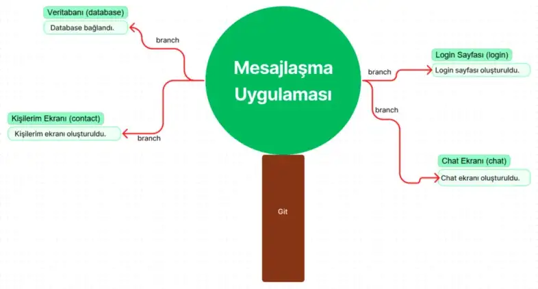

Mesela git’i bir ağaç yapısı olarak düşünürsek bir repo başlatıp üzerinde farklı farklı dallar oluşturabiliriz. Bu dalların adına branch diyoruz. Branchlerimizin adı database, login, contact ve chat olsun. Bir arkadaşımız login branchi üzerinde giriş yapılan ekranı kodlayıp aynı anda farklı bir arkadaşımız chat branchi üzerinde chat ekranı geliştirebilir. Bu branchlerde geliştirdiklerimizi nasıl bir araya getireceğiz? Elbette tüm dalları ağacın gövdesinde birleştireceğiz. Tüm branchleri toplayacağımız ortak bir master branchimiz olacak hepsini orada birleştirdiğimizde yukarıda gördüğünüz gibi gövde üzerinde projenin tamamı bulunacak.

Git yapısı hakkında az çok bilgi sahibi olduğumuza göre artık öğrenmeye başlayabiliriz.

[Git’i buradan indirebilirsiniz.](https://gitforwindows.org) (Windows için)

[Git’ buradan indirebilirsiniz.](https://git-scm.com/download/mac) (Mac için)

Git’i bilgisayarınıza kurduktan sonra Git Bash açarak terminal üzerinde işlem yapmaya başlayabilirsiniz. Eğer terminal deneyiminiz yoksa temel terminal komutlarını öğrenip sonra işlem yapmaya başlamalısınız. Ben sizin için bazılarını buraya bırakıyorum. → [Temel Terminal Komutları](https://gist.github.com/b-tekinli/7b328b8bf6d9f60fdb353404f594cdd8)

- cd --> Dizin değiştirme,
- ls --> Klasör içeriği listeleme,
- ls -la --> Gizli dosyaları gösterme,
- mkdir --> Klasör oluşturma,
- rmdir --> Klasör silme,
- pwd --> Mevcut dizini gösterme,
- rm --> Dosya silme,
- cp --> Dosya kopyalama,
- mv --> Dosya taşıma,
- cat --> Dosya içeriği görüntüleme,
- echo --> Standart çıktıya yazdırma,
- du --> Dizin boyutu gösterme

İlk yapmamız gereken Github hesabımız ile üzerinde çalıştığımız terminali (Git Bash) bağlamak. Bunun için kullanıcı adı ve email girmemiz gerekiyor. Bunu şu komutlar ile gerçekleştiriyoruz:

`git config --global user.name "Beyzanur Tekinli"`

Bunu yazıp enter’a bastıktan sonra kullanıcı adımız ayarlanmış oluyor teyit etmek içinse;

`git config user.name`

Bu komutu yazıp enter’a bastığınızda ekrana kullanıcı adınızın geldiğini göreceksiniz. Bu işlemin aynısını email için yapıyoruz.

`git config --global user.email beyza.tekinli.bt@gmail.com`

Email adresini kontrol etmek için;

`git config user.email`

Artık git ve github hesabınız bağlandığı için git bash üzerinde proje oluşturup çeşitli interaktif işlemler yapmaya başlayabilirsiniz.

Şimdi masaüstünüzde yeni bir klasör oluşturup adına GitOgreniyorum yazabilirsiniz. Bunlar terminal komutları ile sırasıyla şu şekildedir:

- cd Desktop // masaüstüne gitmemizi sağlar.
- mkdir GitOgreniyorum // yeni klasör oluşturmamızı sağlar.
- cd GitOgreniyorum // GitOgreniyorum adlı klasöre girmemizi sağlar.

---

## Git Yapısını İnceleyelim

- Local files → Kendi cihazımızda dosyalar üzerinde çalıştığımız bölüm.
- Staged → Yaptığımız değişiklikleri ekleyip gönderdiğimiz sahne bölümü.
- Local repo → Yaptığımız değişiklikleri kaydedip beklettiğimiz bölüm.
- Remote repo (uzak sunucu) → Github üzerinde görüntüleyebildiğimiz depo.

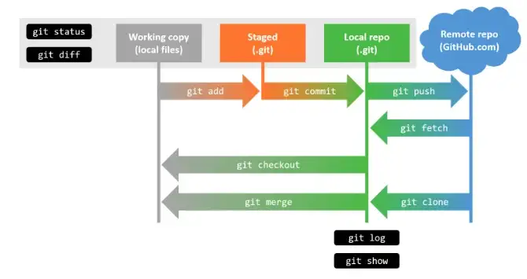

### git init

Şimdi ise git init komutunu kullanacağız. Bu komut, klasör içinde git’i başlatmak demek. Git’i o dosyaya tanıtıyoruz gibi düşünebilirsiniz. Bu komutu yazıp enter’a bastıktan sonra ekranda Initialized ile başlayan cümleyi gördüyseniz başarılı bir şekilde ilerliyorsunuz demektir.

**Not: Eğer yanlışlıkla farklı klasörlerin içine `.git` yazıp eklediyseniz ya da eklerseniz `rm -rf .git` komutuyla kaldırabilirsiniz.**

### git status

Şimdi kullanacağımız komut ise git status komutu. Bu komut ise git’in o anki durumunu gösteriyor. Status kelimesinin İngilizce anlamı durum demek olduğundan git’e “şuan git’in durumu nedir?” diye sorduğumuzu düşünerek bu şekilde aklınızda tutabilirsiniz. Bu komutu yazıp enter’a basın.

> On branch master  
> No commits yet  
> nothing to commit

Ekranda bu şekilde hangi branch üzerinde olduğunuzu commitlenen ve commitlenecek herhangi bir şey olmadığını bize gösterecektir.

### git add

GitOgreniyorum klasörümüzün içine 2 tane yeni dosya oluşturalım. Bunları şu şekilde yapabilirsiniz:

> touch deneme.html  
> touch test.css

Bu komutları yazdıktan sonra klasörümüzün içinde 2 tane dosyamız oluşacaktır. Terminal üzerinde teyit etmek için ls komutunu yazabilirsiniz.
Bunları yazdıktan sonra git status yazarak git’in o anki durumunu kontrol edelim. Ekranda karşılaşacağımız bilgiler şöyle olmalı;

> Untracked files:  
> deneme.html  
> test.css

Burada untracked files ifadesi kırmızı renkle izlenmeyen dosyaları gösterir. Bu dosyaları izleyip yukarıdaki fotoğrafta gördüğümüz staged yani sahnelenen kısma aktarmak için git add komutunu kullanıyoruz. Bu komut şöyle kullanılabilir;

> git add deneme.html

Eğer böyle kullanırsak yalnızca .html uzantılı dosyamızı izleyip staged bölümüne aktarmış olacağız. İsterseniz git status yazarak kontrol edebilirsiniz. Ekranda göreceğiniz bilgiler şöyle olacaktır:

> Changes to be commited:  
> new file: deneme.html  
> Untracked files:  
> test.css

Burada changes to be commited ifadesi bize yeşil renkle izlenen yani commit edilmeye hazır dosyaları local repoya aktarabileceğimizi ifade ediyor. Hala izlenmeyen dosyalarda ise test.css dosyası gözüküyor çünkü onu git add komutumuz ile izlemedik. Peki test.css eklemek için tekrar git add test.css komutunu mu yazmamız gerekiyor? Yalnızca test.css dosyası kaldığı için git add test.css komutunu yazıp az önce yaptığımız gibi bu dosyayı da izleyebiliriz fakat çok fazla dosya olan bir proje üzerinde çalışıyorsak tüm dosya isimlerini böyle tek tek yazacak mıyız? Tabii ki hayır. Tüm dosyaları aynı anda izlemek için;

> git add .

Komutumuzun yanına nokta ifadesini koyduğumuzda tüm klasörleri otomatik olarak ekleyecektir. Eğer şimdi git status yazarsanız yeşil renkle 2 dosyanın da commitlenmeye hazır olduğunu göreceksiniz.

### git commit

Bu komutumuz ise mesaj bırakmamızı sağlıyor. Mesela bir login sayfası hazırlayıp bunu kaydetmek isteyebiliriz. Aslında deftere not alır gibi düşünün login sayfası hazırlandı şeklinde mesaj bırakabilirsiniz. Mesajlaşma uygulaması üzerinden gidelim. Mesela sadece chat ekranı ile ilgili bir değişikliği geri almak istiyoruz fakat aynı anda hem login hem de chat ekranını commitlemişiz bu durumda bir tane geri aldığımızda iki değişikliği de geri almak zorunda olacağız çünkü ikisini tek bir commit olarak atmışız. Bu bize zaman kaybettirecek yanında da birçok dezavantaja neden olacak. Commitlerimizi bölüm bölüm atmalıyız. Bunu yapmamızın nedeni ise geri dönüp baktığımızda sadece login sayfasının yapıldığı yere kadar olan değişiklikleri görüntüleyebilmemizi sağlar. Komutun kullanma şekli ise şöyledir;

`git commit -m "login sayfası oluşturuldu"`

Bu komutu yazıp enter’a bastığımız zaman ekranda **2 files changed, 0 insertions (+), 0 deletions (-)** ifadesini görüyor olmalıyız. Bu ifade bize 2 dosyada değişiklik yapıldığını fakat dosyaların içinde herhangi bir kod satırı olmadığı için 0 eklenen ve silinen olduğunu belirtir. İsterseniz git status yazıp mevcut durumu kontrol edebilirsiniz.

### git log

Bu komut commit geçmişimizi sondan başlayarak başa doğru gösterir. Neden sondan başlar çünkü son attığımız commit’i değiştirmek isteyebiliriz yeni bir şeyler eklemek veya çıkartmak isteyebiliriz bu yüzden. Her commit’in kendine ait hash’i vardır. Bu sayede istediğimiz commit’e bu hashler sayesinde ulaşıp istediğimiz değişikliği yapmamız mümkün. Terminal ekranına yazalım.

> git log  
> // Çıktı: commit ab12c3d34fg56 (HEAD -> master)  
> Author:  
> Date:  
> login sayfası oluşturuldu

şeklinde bir çıktı alırız. commit’in yanında yazan hash, master ise ilk başta bahsettiğim branch ama onun yanında yazan head’i sonra açıklayacağım. Ek bilgi olarak git log’un alabileceği parametrelere değinelim. Ben yalnızca oneline ve graph parametrelerinden bahsedeceğim dilerseniz siz araştırabilirsiniz.

#### git log --oneline

Aşağıdaki fotoğraftaki gibi commitleri bu kadar karışık şekilde görmek istemiyorsanız ve görmek istediğiniz yalnızca commit mesajlarınızsa kullanabileceğiniz parametre.

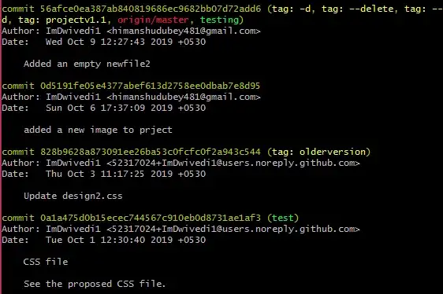

`git log --oneline`

Bu parametreyi kullandığınızda ekranda loglar şu şekilde gözükür;

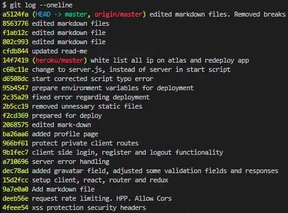

Yani sadece commit olarak attığınız mesajlar gözükür ve istediğiniz commit’e daha hızlı ulaşabilirsiniz.

#### git log --graph

Eğer commitlerimizin hangi branchte birleştiğini görmek istersek bu parametreyi kullanabiliriz.

`git log --graph`

Bu şekilde hangi commit’in hangi branch üzerinde ilerlediğini ve hangi branchlerde birleştiğini görmemizi sağlar.

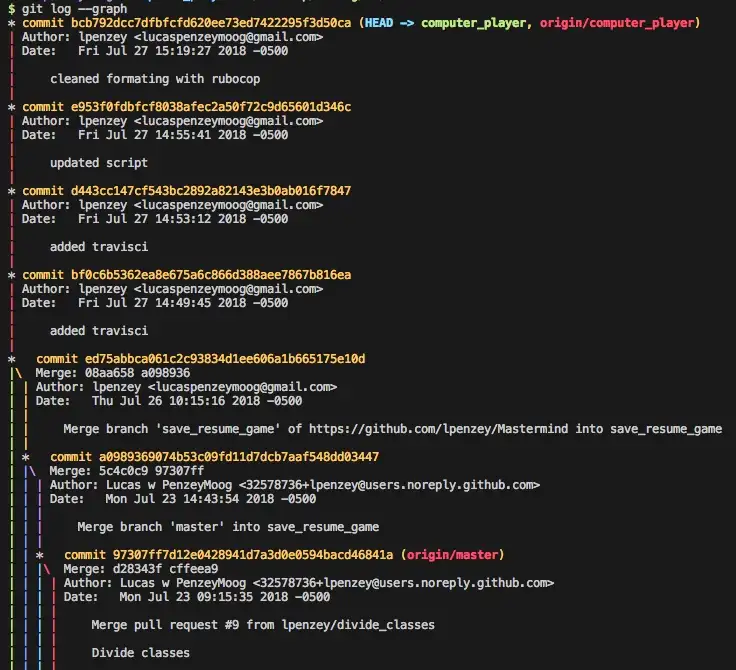

Ama ekran çok karışık gözüküyor ve ben bu branch grafiğini sadece commit mesajlarımla görmek istiyorum ne yapmalıyım? O zaman da bu 2 parametreyi birleştirerek işlem yapabiliriz.

`git log --oneline --graph`

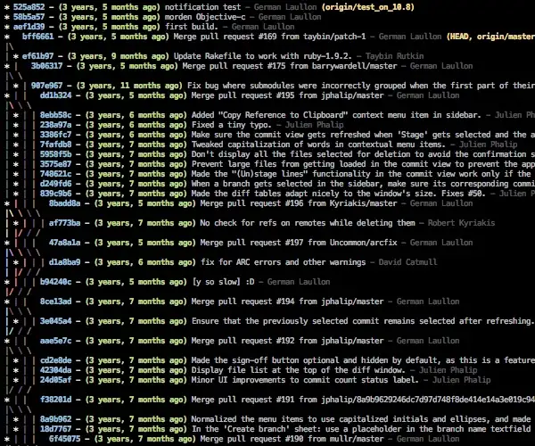
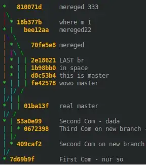

Şimdi isterseniz elinizdeki 2 dosyanın içine bazı satırlar ekleyip bunları sırasıyla

> git add .  
> git commit -m “kodlar yazıldı”  
> git log  
> ile son logları inceleyebilirsiniz.

### git ignore

Bu komutu eklemek istemediğimiz dosyalar olduğunda kullanırız. git add komutunun sonuna nokta ifadesini koyduğumuzda tüm dosyaları eklememizi sağlıyordu fakat bazı durumlarda eklemek istemediğimiz dosyalar olabilir bu yüzden bu durum bize dezavantaj sağlar. Şimdi GitOgreniyorum adlı klasörümüze girip şu komutları yazalım:

> touch ornek.js

Bu komutlarla bir javascript dosyası oluşturduktan sonra içine dosyanın içinde bazı değişiklikler yaparak birkaç satır kod ekleyin. Şimdi ise (yukarıda paylaştığım git yapısı adlı fotoğraftan da bakabilirsiniz) ne staged ne local repo ne de github’a atmak istemediğimiz, sadece çalışma klasörlerimizde bulunmasını istediğimiz, kısacası kimsenin görmesini istemediğimiz, içinde yaptığımız uygulamaya özel güvenlik açığı vs. oluşturacak bilgileri tutan bir dosya oluşturalım. Dosyanın adı gizliBilgiler.txt olsun :) Terminal üzerinde bu dosyamızı oluşturduktan sonra .js uzantılı dosyamızı eklemek isteyip .txt uzantılı dosyayı eklemek istemediğimiz için repoyu kapsayan yani içinde git’i oluşturduğumuz dosya dizininde olup şu komutları yazmalıyız;

`touch .gitignore`

touch komutu yardımıyla .gitignore dosyamızı oluşturduktan sonra bu dosyayı kod editörümüzde açıp içine gizliBilgiler.txt yazıp kaydederek çıkmalıyız. Sonrasında ise terminal üzerinde sırasıyla git add . > git status yazarsak commitlenmeye hazır tüm dosyaları git add . ifadesi ile izletmiş olmamıza rağmen git status ifadesi bize sadece ornek.js adlı dosyayı gösterecektir. Dolayısıyla yüzlerce dosya arasında çalışırken .gitignore adlı bir dosya oluşturup içine yalnızca bizde kalmasını istediğimiz dosyayı yazarak yine git add . komutunu kullanarak büyük avantaj sahibi oluruz.

---

## GIT BRANCH

Branch işlemlerini en başından beri az çok anladık. Git’i ağaç yapısına branchleri ise dal olarak düşünmüştük. Peki branch içinde neler yapılır? Konu başlıkları: _Head, Merge, Fast Forward, Merge Conflict, Stash ve Pop._

> git branch → // branch isimlerini görüntülememizi sağlar.  
> git branch branchName → // branch oluşturmamızı sağlar.  
> git switch branchName → // adını belirttiğimiz branch'e geçmemizi sağlar.  
> git merge branchName → // adı belirtilen branch'i master branch'i (genelde master olur) ile birleştirir.`

Alıştırma olması açısından yukarıdaki komutları kullanarak yeni branch oluşturalım.

`git branch chat`

Mesela chat adlı bir branch oluşturduk. Şimdi yeni bir dosya açıp içine birkaç satır kod ekleyelim.

> touch chat.txt // .txt uzantılı bir dosya oluşturduk.  
> print(“Chat ekranı oluşturuldu.”); // içine eklediğim kodlar

Şimdi ise terminal üzerinde git branch yazalım ve hangi branchler olduğunu gözlemleyelim. Master ve chat branchi olduğunu gördükten sonra chat branchinde bu dosyayı commitleyelim sırasıyla

> git add .  
> git commit -m “chat ekranı tamamlandı.“

bu şekildedir. Chat branchinde bulunduğumuz zaman oluşturduğumuz diğer dosyalar çalıştığımız IDE üzerinde GitOgreniyorum klasörünün içinden silinmiş ya da kaldırılmış gibi gözükmeyebilir . Bunun nedeni chat branchinde bulunmamızdır. Commitledikten sonra git switch master yaptığımızda master branchine geçmiş olacağız ve artık chat.txt dosyası gözükmeyecek çünkü o dosya chat branchinde kaldı. Hepsinin aynı anda gözükebilmesi için birleştirmemiz gerekli bu işleme de merge (birleştirme) diyoruz Head konusundan sonra bahsedeceğiz.

## HEAD

Head, kısaca özetlemek gerekirse hem commit olarak hem de branch olarak o an bulunduğumuz konumu gösterir.

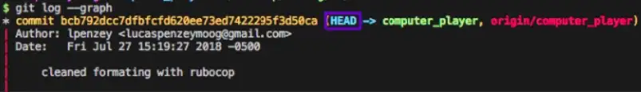

Branch konusuna gelirsek büyük bir e-ticaret şirketinde front-end developer pozisyonunda çalışıyor olduğumuzu varsayalım. Sadece bizimle aynı pozisyonda olan bile onlarca yazılım geliştirici olacak ve biz slider grubundayız diyelim ki. Şöyle bir git haritası ortaya çıkabilir:

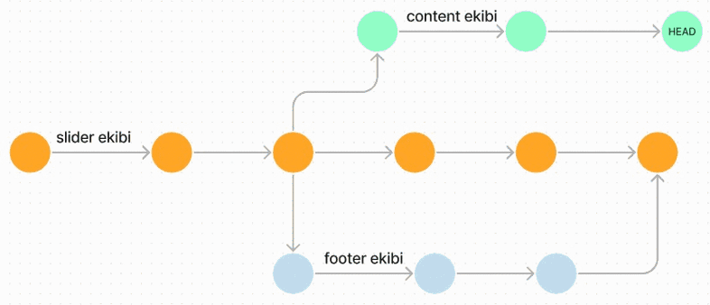

Burada dikkat etmemiz gereken kısım HEAD bölümünün sürekli değişmesi. Onlarca geliştirici ile aynı anda farklı branchlerde çalışıyoruz git log komutunu çalıştırdığımızda en son hangi ekip hangi branch’e commit attıysa HEAD bize branch ve commit olarak güncel konumu gösterecektir.

### Merge

Aslında en başından beri fotoğraflarda gördüğümüz branchleri birleştirme işlemidir. Kullanım şekli:

`git merge branchName`

Başka bir branchte yapılan değişiklikleri, üzerinde çalıştığımız branchle (bu genelde master olur) birleştirme işlemi yapar ve birçok şeyi otomatik olarak entegre eder.

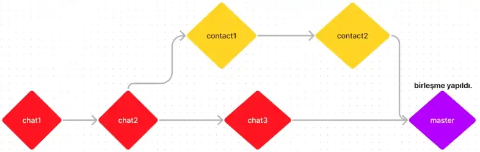

Şimdi terminal üzerinde sırasıyla bu komutları uygulayın;

> git log → // (hangi branchte olduğumuza bakalım head yardımı ile)  
> git switch master → // (chat branchinde bulunuyorsanız bu satırı uygulayın)  
> git merge chat → // (chat branchini master ile birleştirmek)

Bunları uyguladıktan sonra karşımıza bir tane commit mesajı çıkacaktır. Bu mesajda Merge branch ‘chat’ yazar. Bu, birleştirme branchi olduğu için buraya bir commit atmamızı ister. Karşımıza çıkan mesajın anlamı chat ile master birleştirildi demektir. İsterseniz o şekilde kalabilir farklı bir şey de yazabilirsiniz. Artık çalışma klasörlerimizde 2 branchteki dosyalarımız da görünecektir.

### Fast-Forward

Merge anlatırken konu kafamızda tam olarak otursun diye diğer branch’e chat diyerek örnek verdim fakat buna aslında feature derler bundan sonrası için ben de feature diyeceğim. Fast-Forward, feature branchimizle master branchimizi birleştireceğimiz anda master üzerinden herhangi bir commit yapılmamışsa, git default olarak master branchinin en son commitlenen hash’i yerine feature branchinin hash’ini alır. Buna da fast-forward merging denir. Çoğu zaman 2 branch de farklı farklı ekipler tarafından geliştirildiği için sürekli olarak commit alır ve dolayısıyla bir ekip diğerinden daha hızlı çalışıyor ve daha çok commit atıyorsa o branch’in tarihçesi diğer branch’ten uzaklaşır. Durum böyle olduğunda merge işlemi yapılacağı zaman, git 2 branch’in de tüm commitlerini barındıran otomatik olarak ortak bir commit haline getirir. Bu commit’e ise **merge commit** denir.

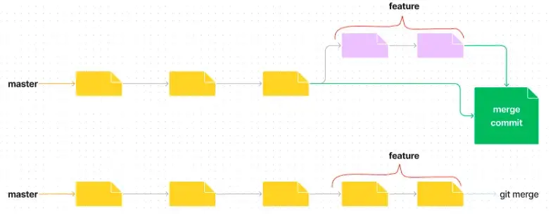

Bu görsel ile daha iyi anlaşılacağını düşünüyorum. Uygulama olarak sırasıyla aşağıdakileri yapalım.

> git branch programlama → // programlama adında bir branch oluşturduk.  
> git branch → // mevcut branchleri görüntülüyoruz (chat kaldıysa feature da ekleyebilirsiniz dilerseniz).  
> git switch programlama → // programlama adlı branche geçiş yaptık.  
> touch javaOgren.txt → // javaOgren adında .txt uzantılı bir dosya oluşturduk.

oluşturduğumuz dosyanın içerisine girip "java öğreniyorum" yazıp kaydedelim

> git add . → // oluşturduğumuz dosyayı commitlemek için izledik  
> git commit -m "java ogrenildi"

şimdi tekrar dosyanın içine girip "java ile uygulama yapıldı" yazalım ve tekrar commit atalım

> git add .  
> git commit -m "program gelistirildi"  
> git log → // master'ın kaldığı yer bizim 2 commit öncemiz olması gerekir.

aynı zamanda fark ettiyseniz master üzerinde hiçbir şey yapmadık.

> git switch master → // şimdi master branchine geçiş yaptık.

editörümüzde javaOgren.txt adlı dosyanın kaybolduğunu görmüş olmalısınız çünkü programlama branchinde kaldı  
artık merge edebiliriz.

> git merge programlama

ekranda Fast-Forward yazısını görmüş olmalısınız.

> git log → // en son attığımız commit'in HEAD kısmını şöyle görmelisiniz:  
> (HEAD --> master, programlama)

Bu uygulamayı yaptıktan sonra konu kafanızda daha iyi oturacaktır.

### Merge Conflict

Conflict kelimesinin Türkçe karşılığı çakışmak, ayrışmak demektir. Mesela bir arkadaşınızla aynı proje üzerinde çalışıyorsunuz ve aynı dosyayı ya da satırları değiştirdiniz. Git, hanginizin kodunu kabul etmeli? Buna kendi başına karar veremeyeceğine göre otomatik olarak merge işlemi gerçekleşememiş yani çakışma meydana gelmiş oluyor. Bu duruma **merge conflict** denir.

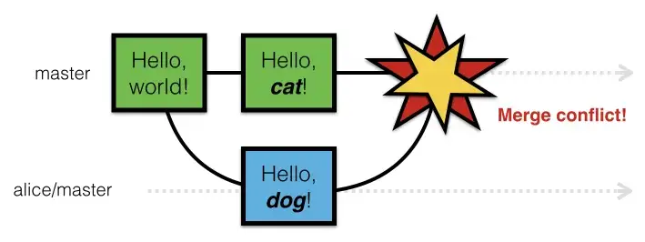

Peki merge conflict yaşadığımızda nasıl çözeceğiz? 2 kişinin de birlikte hangi kodu yazmak istediklerine karar verip yalnızca birini yazmalarıdır. Sonrasında merge işlemine devam edilebilir. Bunun uygulamasını master’ın içine bir dosya oluşturup aynı zamanda da bir branch oluşturup branchin içinde de masterdaki aynı dosyayı değiştirmeyi deneyerek merge etmeye çalışabilirsiniz.

### Stash

Stash’in Türkçe karşılığı saklamaktır. Genel olarak commitlerimizi kodlarımız bittiğinde gerçekleştiririz. Peki diyelim ki kodlarımız bitmedi acil bir işimiz çıktı ve mevcut dosyalarımızı commit yapmak istemiyoruz ama o zamana kadar olan yaptığımız değişiklikleri geçici olarak saklamak istiyoruz. Bu durumda ne yaparız? İşte bu sırada devreye stash giriyor.

> git branch stashBranchi // stashBranchi adında yeni bir branch oluşturduk.  
> git switch stashBranchi // stashBranchi'ne geçiş yaptık.  
> touch stashDosyasi.txt // stashDosyasi adında .txt uzantılı bir dosya oluşturduk.

dosyanın içine girip "bugün stash öğrendim." yazabilirsiniz.

> git stash // stash komutumuzu dosyalarımızı saklaması için çalıştırdık.

komutunu çalıştırdığınızda çalışmalarınızı commit etmeden saklayacaktır.  
ve dosyalarınızın arasından branch değiştirmiş gibi çalışmaları kaldıracaktır.  
herhangi bir değişiklik yapmadan pop konusuna geçelim.

_Not: Eğer burada **git status** komutunu çalıştırırsanız öncesinde commit edilmemiş bir dosya olarak görünen stashDosyasi adındaki dosyanın değişikliklerini görüntüleyemezsiniz. Bunun nedeni ise master branch’i **git stash** komutu çalıştırıldıktan sonra dosyalarımızı geçici olarak da olsa kayıt altına alacağı için temizlenecektir._

### Pop

Bu komut stash komutu ile bağlantılıdır bu yüzden bu konuda stash ile ilgili olan birkaç komuta daha değineceğiz. Stash konusunda dosyalarımızı geçici olarak saklamayı öğrendik ama bunları nasıl geri alacağımızı öğrenmedik. Burada da pop komutu devreye girmektedir. Kullanımı:

`git stash pop`

Pop için önemli olan nokta ise en son yapılan stash’i geri almasıdır. Mesela art arda 3 tane stash yaptık.

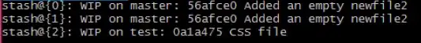

Bu stashlerimizi listelemek için;

`git stash list → // stash listesini gösterir.`

Pop, bu 3 stash sonrasında çalışmalarımızı geri almak istediğimizde en son yapılan stash’i yani en alttaki {2} numaralı stash’i geri alacaktır. Kafanızda oluşan soruyu tahmin etmek zor değil. Art arda 17 tane stash yapmış olsak bunların hepsini tek tek pop ile mi geri alacağız? Yaptığımız stashlerin hepsini geri almak için de bir yöntem var tabii ki. Buna ise;

`git stash apply`

apply ve pop arasındaki farkı görmemizi sağlayacak bir görsel bırakıyorum.

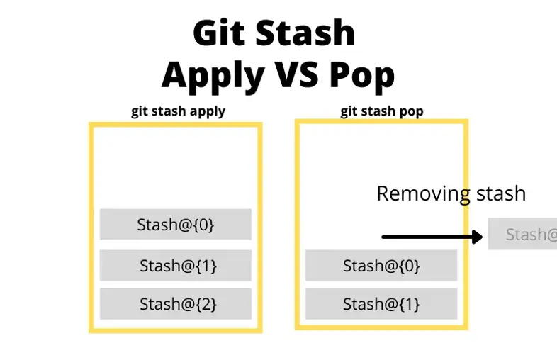

**git stash apply** yaptığımız tüm değişiklikleri geri almamızı sağlar ama bu komuttan sonra yüklediğimiz değişiklikler listeden silinmez. Bu değişikliklerden birini mesela ortadakini listeden silmek için;

`git stash drop stash@{1}`

---

## Geçmişe Dönme - Zamanda Yolculuk Yapmak - Panik Yönetimi

### git restore

Git üzerinde çalışırken yanlış bir kod yazıp commit ettiğimizde bunu herhangi bir bilgimizi silmeden düzeltmemizi sağlar. Kullanımı:

`git restore`

### git amend

Genelde sürekli commit mesajlarımızda yanlış harf kullanımı, imla hatası gibi hatalarımız olur ve yaptığımız commit mesajını yenilemek isteyebiliriz. Bunu amend komutu ile düzeltmek mümkündür. amend parametresi ile commit mesajını tekrar düzenleyeceğimiz ekran açılır. Kullanımı;

> git commit --amend // kod düzenleyici ekran açılır.  
> git commit --amend -m "commit düzeltildi." // -m parametresi tek satırda yazabilmek için

Şimdi de bu commit’e bir dosya daha eklemek istediğimizi ama unuttuğumuzu fark ettiğimiz senaryosunu ele alalım. Burada yine amend yardımımıza koşuyor.

> touch component.txt  
> touch widget.txt // commit içine atmayı unuttuğumuz dosya  
> git add widget.txt // widget dosyasını izledik  
> git commit -m "component ve widget eklendi"  
> git status // ekranda sadece widget gözükecektir çünkü sadece onu ekledik  
> git add component.txt  
> git commit --amend --no-edit // --no-edit ile commit mesajını değiştirmeden dosya ekledik
> git status

### checkout

Örneğimizi git restore üzerinden verelim. Mesela yanlış commit ettiğimiz bir dosyayı restore ettik buna rağmen içimize sinmedi. Bu durumda yaptığımız değişikliği geri almak için git checkout kullanırız.

Geri almak istediğimiz commit'in hash'ini (id'sini) alıp şu şekilde kullanıyoruz:

`git checkout 12asdfg2456Adfhbdf8910``

5 kez üst üste commit attık ama en son attığımız içimize sinmediğinden geri aldık. Bu durumda en son yaptığımız değişikliğin gelmediğini göreceğiz. Yani aslında zamanda yolculuk yapıp geri gittiğimizden dolayı 5. commit’teki değişiklikler gelmemiş olacak. Fakat amacımız o değişikliklerin kaybolmaması. Onları tekrar nasıl görüntüleyeceğiz? Bu komutlarla;

> git checkout master // master branchimizdeki değişiklikleri geri aldık.  
> git log // son yaptığımız commitleri görüntelemek için kullandık.

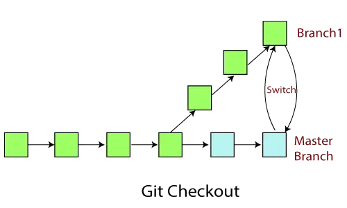

### git reset vs git revert

Yaptığımız tüm değişiklikleri geri almak istediğimizde git reset, herhangi bir değişikliği geri almak için ise git revert kullanırız.

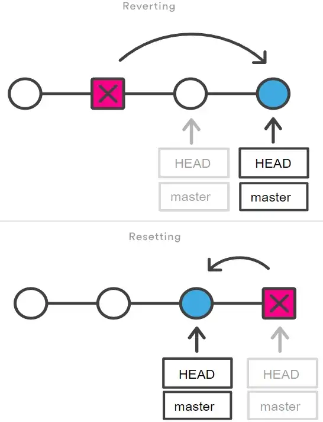

Yukarıdaki görselde görüldüğü gibi revert istediğimiz bir değişikliği geri alan yeni bir commit oluşturuyor, reset ise tüm değişiklikleri geri almamızı sağlıyor ama revert yöntemine göre biraz daha tehlikeli bir yöntemdir. Art arda 3 tane commit atıp 3. commit’i geri almak istediğimizi düşünelim. Bu senaryoda attığımız bir commit’i git revert ile geri aldığımız görelim.

`git revert e137e9b`

Kullanımını da bu şekilde gördük şimdi aşağıdaki görselle yeni bir commit oluşturulduğunu da kafamızda oturtalım.

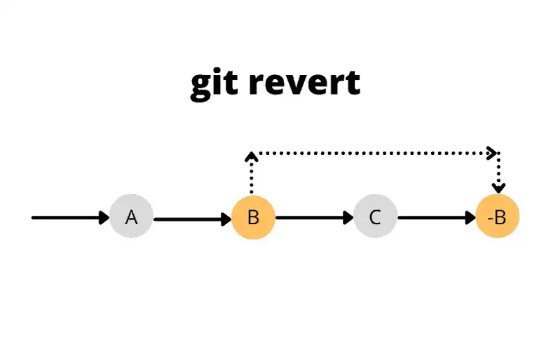

Şimdi senaryomuzda git revert geri alırken de bir commit ürettiği için bundan rahatsız olup `git reset HEAD~1` ile commit’i geri alalım. Bu durumda git revert ve izleri silinir.

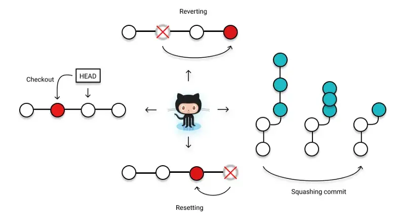

### git diff

Bu komut İngilizce difference (fark) kelimesinin kısaltması olarak karşımıza çıkıyor. Git üzerinde ise 2 versiyon arasındaki farkları görüntülemek için kullanılır. Az önce 3 tane art arda commit atmıştık bu konu üzerinden düşünecek olursak büyük bir proje üzerinde çalıştığımızı ve sürekli commit attığımızı düşünelim bu durumda hangi commitler arasında nasıl farklar oluştuğunu unutup bunları görüntülemek isteyebiliriz. Çalıştığımız dosyalar üzerinde hiçbir değişiklik yapmayıp yalnızca `git diff` yazarsak ekrana hiçbir şey gelmez. Fakat bir dosyanın içinde kodlarımız arasında bir değişiklik yaptığımızda, mesela yeni bir satır kod eklediğimizde `git status` komutunu çalıştırdığımız zaman ekranda değişiklik yaptığımız dosyayı `modified: ornekDosya.txt` şeklinde görüntüleyebiliriz. Şimdi ise ekrana `git diff`yazarsak kırmızı ve yeşil renklerle nelerin silindiğini ve eklendiğini kısaca versiyonlar arası farkı görüntüleyebiliriz. `git diff HEAD` çalıştırdığımızda ise son commit’teki değişiklikleri görebiliriz. Eğer herhangi 2 commit arasındaki farkı görmek istiyorsak hashlerine `git log` ile ulaşarak aşağıdaki kullanabiliriz;

> git diff commitHash1 commitHash2  
> git diff 123sdf61s8df9s1df6a51s216 135s4df84sd8fs1df8s1651

Eğer hash kodları arasında space (boşluk) olduğundan dolayı hata verirse kodlar arasında : ifadesini kullanabilirsiniz.
Örnek:

> git diff 123sdf61s8df9s1df6a51s216:135s4df84sd8fs1df8s1651

Branchler arasındaki farkı görmek istersek:

> git diff master ornekBranch

### rebase

Bu komut da merge komutunun bir alternatifi olarak kullanılıyor aslında. Aynı merge gibi 2 branchteki değişiklikleri birleştirmek için kullanılır.

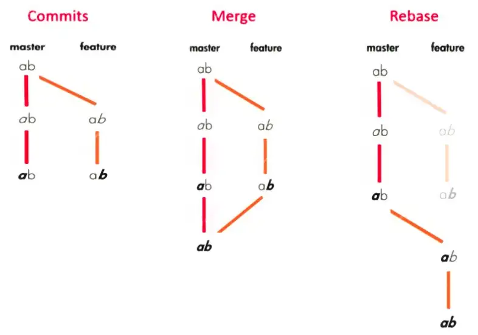

Bu görsel ile çok net anlaşılmıştır diye düşünüyorum. Ama aklınızda şu soru olabilir. Peki neden merge varken rebase de var? Çünkü aşağıdaki görselde olduğu gibi sürekli feature branchinde merge edildikçe özellikle de projede çalışan onlarca kişi varsa çok kirli bir log oluşacak. Bu durumu sorun etmeyebilirsiniz ama aynı branch üzerindeki mergelerimizi başka insanlar da kullanıyorsa ve rebase yaparsak hepsi tek bir branch üzerinde toplanacağı için diğer çalışan arkadaşlarımızın kodlarını mahvedebiliriz. Bu yüzden kullanırken dikkat etmekte fayda var.

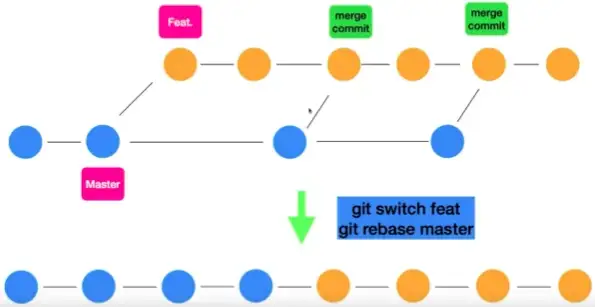

Eğer feature branchinde isek `git rebase master` çalıştırdığımızda tüm değişikliklerimizi başarılı olarak dümdüz sıralı şekilde dizebiliriz. Şimdi ` git log` çalıştırdığımızda feature ve masterdaki tüm commitleri aynı anda görebiliriz.

### git push

Son olarak ise Github web sitesine tüm değişikliklerimizi göndermek için kullandığımız komut olan git push’a bakalım.

Herhangi bir dosya içinde değişiklik yapıp kaydedelim.

> git add .  
> git commit -m "eklendi"  
> git push // githuba gönderdik.

### git rm

Bir git repo’su üzerinden herhangi bir dosya silmek için rm kullanabiliriz.
Mesela:

> git rm signature.txt  
> git commit -m “dosya silindi.”  
> git push

şeklinde dosyayı kaldırmış oluruz.

Umarım faydalı olmuştur. İyi çalışmalar herkese :)
