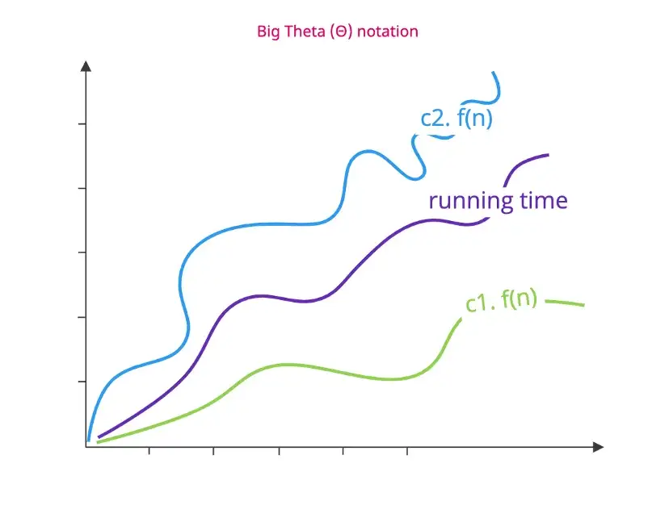
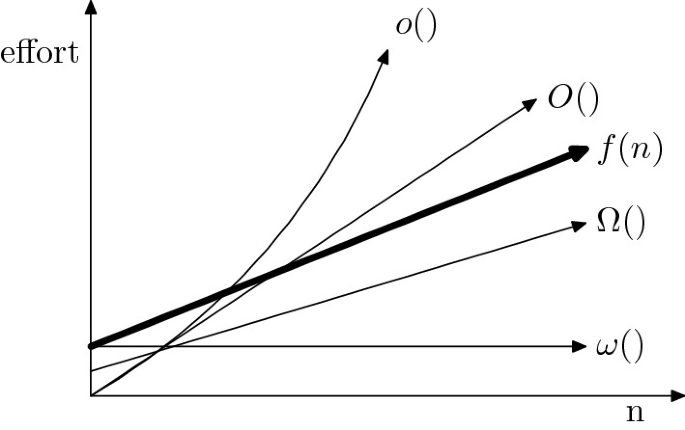

# Asymptotic Notations

<!--- Import Component Here --->

import Tabs from '@theme/Tabs';
import TabItem from '@theme/TabItem';

<!--- Content - Start --->

**Asimptotik (asymptotic) notasyon**, input boyutuna bağlı olarak bir algoritmanın çalışma süresini tanımlar. Bu kavram bilgisayar biliminde çok önemlidir çünkü asimptotik notasyon yazılım mühendislerinin yazdıkları algoritmanın verimliliğini ölçmeye yardımcı olur.

Herhangi bir algoritmanın karmaşıklığını zaman (time) ve alan (space) açısından analiz etmek söz konusu olduğunda, algoritmanın gerektirdiği zamanı ve alanı tanımlamak için kesin bir sonuca ulaşamayız. Çünkü bir algoritmanın çalışma süresi her bilgisayarda farklı olacaktır. Bu durum bilgisayarın hızı gibi faktörlere dayandığı için bu konuyu matematiksel olarak ele almakta yarar var.

Bir algoritmanın karmaşıklığını **asimptotik notasyonlar** olarak da bilinen bazı standart gösterimleri kullanarak ifade ederiz.

Asimptotik notasyon bize şu soruların cevabını verir:

- Input boyutu arttığında algortima birden yavaşlar mı?
- Algoritmada input boyutu arttıkça hızını her zaman korur mu?

## Asimptotik Notaston Türleri

Input’un boyutu arttıkça herhangi bir algoritmanın büyüme eğrisini temsil etmek için aşağıda yer alan asimptotik notasyonun 3 türünü kullanırız:

- Big Theta (Θ)
- Big Oh(O)
- Big Omega (Ω)

### Sıkı Sınırlar (Tight Bounds): Theta

Tight bounds kelimesinin anlamı; bir algoritmanın input’u veri yapısının en iyi (best case) ve en kötü (worst case) çalışma performansı arasındaki farkı gösterir. Yani bir algoritmanın tight bound’u üst sınır ile alt sınır arasında yer alır. Bunu şu şekilde gösterebiliriz: Ω(n)≤Θ(n)≤O(n)

<Image copyRight="CopyRight">

</Image>

f(n) değeri her zaman c1(g) ve c2(g) arasında olacaktır. (c1 ve c2 sabittir)

Örneğin; bir array'imiz var ve bu array'de istenen elemanın bulmak istiyoruz. Bu işlem için theta gösterimi Θ(n)'dir. Çünkü istenen değerin verilen dizide ortalarda olduğunu düşünebiliriz.

### Upper Bounds (Üst Sınır): Big-O

[Big-O notasyonu](https://cs-space.vercel.app/algorithms/analysis-of-algorithms/big-O-notation) bir algoritmanın üst sınırı (upper bound) ya da worst case’i olarak bilinir. Bu ifade bize belirli bir fonksiyonun n girişinin (input) herhangi bir değeri için belirtilen bir süreyi asla aşmayacağını söyler.

İyi de asimptotik notasyonda theta gösterimine sahipken neden big-o’ya ihtiyaç duyalım? Gelin bu soruyu bir örnekle cevaplandıralım:

Linear search algoritması istenen sayıyı bulabilmek için bir array’deki elemanları teker teker gezer. [Worst case’de (en kötü durum)](https://cs-space.vercel.app/algorithms/analysis-of-algorithms/worst-average-and-best-cases#-en-k%C3%B6t%C3%BC-durum-worst-case-analizi-en-%C3%A7ok-kullan%C4%B1l%C4%B1r) istenen sayıyı bulabilmek için array’in ilk elemanından başlarız. Verilen sayı array’in sonuncu elemanıdır. Küçük boyutlu girdilerde en kötü durumu çok umursamayabiliriz ama 10.000 elemanı olan bir array’deki sonuncu elemana ulaşmak bu durumda oldukça yavaş gerçekleşir. Yani n (dizinin boyu kadar) zamanda işlem tamamlanır. Bu nedenle bir algoritmanın üst sınırını düşünerek o algoritmayı bu şekilde seçmek uygulamalarımızı daha hızlı hale getirecektir.

Yani big-o şunu ifade eder; bu notasyondaki O(n) ile gösterilen n girdi boyutundan asla büyük değildir.

<Image copyRight="CopyRight">

</Image>

### Lower Bounds: Omega

Big Omega Notasyonu bir algortimanın alt sınırını (lower bound) ya da daha farklı bir ifadeyle en iyi durumunu (best case) tanımlamak için kullanılır.

Bu notasyon her zaman herhangi bir algoritmanın bütün veri girişlerindeki gerekli minimum zamanı gösterir.

<Image copyRight="CopyRight">

</Image>

<!--- Content - End --->

<!--- Links Source - Start --->

## Kaynaklar Baglantisi

:::info Kaynaklar Bağlantısı

<Tabs>
  <TabItem value="youtube-videos" label="Youtube videoları" default>
    <ul>
      <li>
        <a href="https://youtu.be/xRRTRt8MJFg?list=PLceNgbKeayldExZndJ3UJJcNWwJ1EkYA0">
          Algoritma Analizi#2 - Big O Notasyonu
        </a>
      </li>
      <li>
        <a href="https://youtu.be/E6DjPQE4Y_4?list=PLceNgbKeayldExZndJ3UJJcNWwJ1EkYA0">
          Algoritma Analizi#3 - Ω(Omega) Notasyonu
        </a>
      </li>
      <li>
        <a href="https://youtu.be/OMjIETZUbgo?list=PLceNgbKeayldExZndJ3UJJcNWwJ1EkYA0">
          Algoritma Analizi#4 - θ(Teta) Notasyonu
        </a>
      </li>
    </ul>
  </TabItem>
  <TabItem value="blog-article" label="Blog & Makale">
    <ul>
      <li>
        <a href="http://ercumentturk.com/yazilim/asimptotik-notasyonlari-ve-temel-verimlilik-siniflari/">
          Asimptotik Notasyonları ve Temel Verimlilik Sınıfları
        </a>
      </li>
      <li>
        <a href="https://seymagoksel.medium.com/algoritma-analizi-ve-big-o-notasyonu-3b7aefa8a051">
          Algoritma Analizi ve BIG-O Notasyonu
        </a>
      </li>
    </ul>
  </TabItem>
  <TabItem value="questions" label="Sorular">
    <ul>
      <li>
        <a href="https://quizizz.com/admin/quiz/5f8a7bf12bf8b0001b3029f7/asymptotic-notations-practice-questions">
          Asymptotic Notations Practice Questions
        </a>
      </li>
    </ul>
  </TabItem>
</Tabs>

:::

<!--- Links Source - End --->
