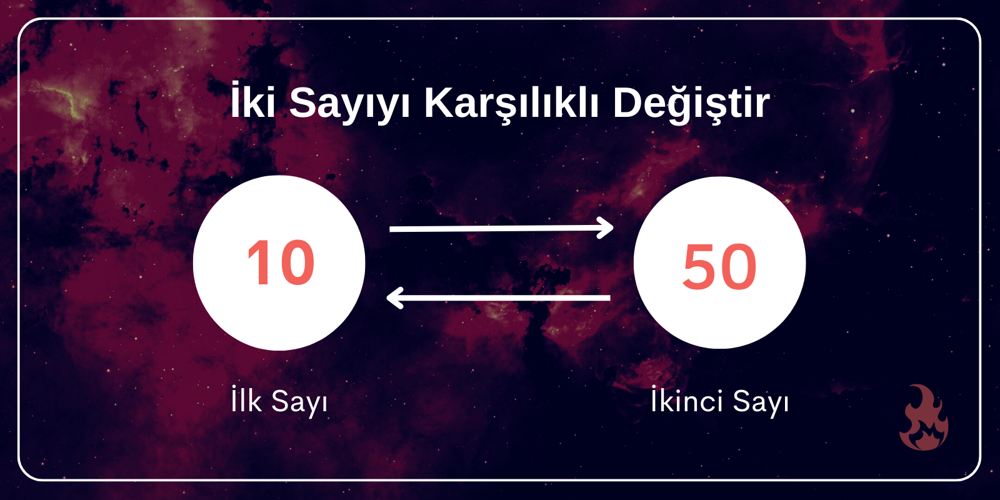

# Analysis of Loops

<!--- Import Component Here --->

import Tabs from '@theme/Tabs';
import TabItem from '@theme/TabItem';

<!--- Content - Start --->

## Döngüler Algoritmaların Karmaşıklık Analizinde Nasıl Analiz Edilir?

Önceki yazılarımızda [Asymptotic Analysis](https://cs-space.vercel.app/algorithms/analysis-of-algorithms/asymptotic-analysis), [Worst, Average and Best Cases](https://cs-space.vercel.app/algorithms/analysis-of-algorithms/worst-average-and-best-cases) ve [Asymptotic Notations](https://cs-space.vercel.app/algorithms/analysis-of-algorithms/asymptotic-notations) konularını tartışmıştık. Bu yazıda yinelemeli programların analizini basit bir örnekle konuşacağız.

### 👉 Sabit Zaman Karmaşıklığı (Constant Time Complexity) O(1)

Eğer bir fonksiyon döngü, özyineleme (recursion) ve başka herhangi bir sabit olmayan zamanlı fonksiyon çağırısı içermiyorsa o fonksiyonun veya durumun zaman karmaşıklığı (time complexity) O(1) olarak kabul edilir. Yani, **sabit zaman karmaşıklığı** özyineleme ve döngü içermeyen ifadelerdir.

:::note Örnek

<details>
  <summary>swap() fonksiyonu O(1) zaman karmaşıklığına sahiptir.</summary>
  <div>
    <h4>İki Sayıyı Karşılıklı Değiştiren (Swap) C Programı</h4>

     Girdi: x = 10, y = 20
     Çıktı: x = 20, y = 10

     Girdi: x = 200, y = 100
     Çıktı: x = 100, y = 200

  </div>
<Image copyRight="Fire Ocean">



</Image>

<b>
  Soru çözümünden önce lütfen “
  <a href="https://practice.geeksforgeeks.org/problems/swap-two-numbers/0">
    <i>PRATİK</i>
  </a>
  ” yaparak kendinizi deneyin.
</b>
<br />
<br />
Amaç çok basit:{' '}

<ol>
  <li>
    Geçici bir değişkene x’i atamak: <b>temp = x</b>
  </li>
  <li>
    x’e y’i atamak: <b>x = y</b>
  </li>
  <li>
    y’ye geçici değişkeni atamak: <b>temp = y</b>
  </li>
</ol>

<u>Bir örnekle bunu daha iyi öğrenelim</u>

<br />
<br />

    x = 100, y = 200

    İlk satırdan sonra: temp = x → temp = 100
    İkinci satırdan sonra: x = y → x = 200
    Üçüncü satırdan sonra: y = temp → y = 100

```jsx
// C programlama dilinde iki değişkenin değerlerini değiş tokuş etmek

#include

int main()
{
    int x, y;

    printf("x için bir değer girin: ");
    scanf("%d", &x);

    printf("\ny için bir değer girin: ");
    scanf("%d", &y);

    int temp = x;

    x = y;
    y = temp;

    printf("\nDeğiştirdikten Sonra: x = %d, y = %d", x, y);

    return 0;
}
```

<b>Çıktı</b>

```
x için bir değer girin: 12

y için bir değer girin: 14

Değiştirdikten sonra: x = 14, y = 12
```

<b>Zaman Karmaşıklığı:</b> O(1)
<br />
<b>Alan Karmaşıklığı:</b> O(1)

</details>

<details>
  <summary>Bir döngü ya da özyineleme de sabit sayıda çalışıyorsa O(1) olarak kabul edilir. Örneğin aşağıdaki döngünün zaman karmaşıklığı O(1)’dir.</summary>

```jsx
// c değişkeni sabittir.

for (int i = 1; i <= c; i++) {
  //bazı O(1) ifadeleri
}
```

</details>
:::

### 👉 Linear Zaman Karmaşıklığı (Linear Time Complexity) O(n)

Eğer bir döngünün değişkenleri sabit bir miktarda azaltılmışsa ya da arttırılmışsa bu döngünün zaman karmaşıklığını O(n) olarak kabul ederiz. Aşağıda yer alan örnekteki fonksiyonlar O(n) zaman karmaşıklığına sahiptir.

```jsx
//c değişkeni sabit bir pozitif tamsayıdır (sabit = miktarı değişmeyen)

for (int i = 1; i <= n; i += c) {
	  //bazı O(1) ifadeleri
}

for (int i = n; i > 0; i -= c) {
	  //bazı O(1) ifadeleri
}
```

### 👉 Quadratic Zaman Karmaşıklığı (Quadratic Time Complexity) O(n^c)

Quadratic zaman karmaşıklığı performansı giriş değerlerinin karesiyle doğru orantılı olan bir algoritma olarak tanımlanır. Çünkü bu tarz algoritma örneklerinde bir linear işlemin içerisinde başka bir linear işlem çalıştırılmaktadır (n\*n = n<sup>2</sup>). Örneğin, aşağıdaki örnekteki döngünün zaman karmaşıklığı O(n^2)’dir.

```jsx
for (int i = 1; i <= n; i += c) {
    for (int j = 1; j <= n; j += c) {
        //bazı O(1) ifadeleri
    }
}

for (int i = n; i > 0; i -= c) {
    for (int j = i + 1; j <= n; j += c) {
        //bazı O(1) ifadeleri
    }
}
```

:::note Örnek
[Selection Sort](https://cs-space.vercel.app/algorithms/sorting-algorithms/selection-sort) ve [Insertion Sort](https://cs-space.vercel.app/algorithms/sorting-algorithms/insertion-sort) algoritmalarının zaman karmaşıklığı O(n^2)’dir.
:::

### 👉 Logaritmik Zaman Karmaşıklığı (Logarithmic Time Complexity) O(Logn)

Eğer bir döngü değişkenleri sabit bir miktarda çarpılmış ya da bölünmüşse bu döngünün zaman karmaşıklığı O(Logn) olarak kabul edilir.

```jsx
for (int i = 1; i <= n; i *= c) {
    // bazı O(1) ifadeleri
}
for (int i = n; i > 0; i /= c) {
    // bazı O(1) ifadeleri
}
```

Ayrıca özyinelemeli fonksiyonlarda özyinelemeli çağrıların zaman karmaşıklığı O(Logn) olarak kabul edilir.

```jsx
// Özyinelemeli (recursive) fonksiyon

void recurse(n);
{
  if (n == 0) return;
  else {
    // bazı O(1) ifadeleri
  }
  recurse(n - 1);
}
```

:::note Örnek
[Binary Search](https://cs-space.vercel.app/algorithms/searching-algorithms/binary-search) algoritmasının zaman karmaşıklığı O(Logn)’dir.
:::

### 👉 Logaritmik Zaman Karmaşıklığı (Logarithmic Time Complexity) O(Log Log n)

Eğer bir döngünün değişkenleri sabit bir zamanda katlanarak azalıyorsa ya da artıyorsa bu döngünün zaman karmaşıklığı O(LogLogn) olarak kabul edilir.

```jsx
// Burada c girdisi 1’den daha büyük bir sabittir
for (int i = 2; i <= n; i = pow(i, c)) {
    // bazı O(1) ifadeleri
}

// Burada fun bir kare kök, küp kök veya sabit bir köktür.
for (int i = n; i > 1; i = fun(i)) {
    // bazı O(1) ifadeleri
}
```

### 💠 Bir Döngü Değişkeninin Katlanarak “Küçülmesi ya da Büyümesi” nin Zaman Karmaşıklığının Matematiksel Detayı

Bu gibi durumlar için bir döngünün zaman karmaşıklığı O(log(log(n)))’dir. Aşağıdaki ele aldığımız problemin farklı yönlerini analiz eder.

**Durum 1**

```jsx
for (int i = 2; i <=n; i = pow(i, k))
{
    // bazı O(1) ifadeleri veya durumları
}
```

Bu durumda i değişkeni 2, 2<sup>k</sup>, (2<sup>k</sup>)<sup>k</sup>, (2<sup>k<sup>2</sup></sup>)<sup>k</sup> = 2<sup>k<sup>3</sup></sup>, ....2<sup>k<sup>log<sub>k</sub>(log(n))</sup></sup> değerlerini alır. En sonuncu ifade n’den küçük ya da n’e eşit olmalı ve biz 2<sup>k<sup>log<sub>k</sub>(log(n))</sup></sup> = 2<sup>log(n)</sup> = n ifadesine sahibiz. Bu ifade son terimimizin değeriyle tamamen uyuşuyor. Böylece toplamda bir çok log<sub>k</sub>(log(n)) yineleme söz konusu ve her bir yinelemenin çalışması sabit bir süre alır. Bu nedenle toplam zaman karmaşıklığı O(log(log(n)))’dir.

**Durum 2**

```jsx
// func() herhangi bir sabit kök fonksiyonudur
for (int i = n; i > 1; i = func(i))
{
   // bazı O(1) ifadeleri veya durumları
}
```

Bu durumda i değişkeni n, n<sup>1/k</sup>, (n<sup>1/k</sup>)<sup>1/k</sup> = n<sup>1/k<sup>2</sup></sup>, n<sup>1/k<sup>3</sup></sup>, n<sup>1/k<sup>log<sub>k</sub><sup>(log(n))</sup></sup></sup> değerlerini alır. Böylece toplamda log<sub>k</sub>(log(n)) yineleme var ve her bir yineleme O(1) zaman alır. Böylece toplam zaman karmaşıklığı O(log(log(n)))’dir.

### 💠 Ardışık Döngülerin Zaman Karmaşıklığı Nasıl Birleştirilir?

Ardışık döngüler olduğunda döngülerin tek tek zaman karmaşıklıklarının toplamını hesaplarız.

```jsx
for (int i = 1; i <= m; i += c) {
    // bazı O(1) ifadeleri
}

for (int i = 1; i <= n; i += c) {
    // bazı O(1) ifadeleri
}
```

**Zaman Karmaşıklığı 👆**

<ul>
  <li>O(m) + O(n)</li>
  <li>daha da sadeleştirirsek ▶️ O(m + n)</li>
  <li>
    eğer m === n ise ▶️ 2n olur. Bunun sonucunda O(n) olur. (Katsayıları dikkate
    almayız.)
  </li>
</ul>

### 💠 Eğer Bir Döngünün İçinde Çok Fazla If-Else Koşulu Varsa Zaman Karmaşıklığı Nasıl Hesaplanır?

[Bu yazıda](https://cs-space.vercel.app/algorithms/analysis-of-algorithms/worst-average-and-best-cases) anlattığımız gibi en kötü durum zaman karmaşıklığı ortalama (average) durum, en iyi (best) durum arasında en çok kullanılandır. Bu nedenle en kötü durumu kabul etmemiz gerekiyor. If-else koşullarındaki değerler ifadenin maksimum sayıda yürütülmesine neden olduğu zamanlarda durumu değerlendiririz.

<u>Örneğin</u>; bir dizide bir elemanın sonuncu öğe olduğunu ya da mevcut
olmadığını dikkate aldığımız linear search fonksiyonunu düşünelim. Kod tüm
if-else durumlarını dikkate alamayacak kadar karmaşık olduğunda if-else durumunu
ve diğer karmaşık kontrolleri görmezden gelerek bir üst sınır (upper-bound)
belirleyebiliriz.

### 💠 Özyinelemeli (Recursive) Fonksiyonların Zaman Karmaşıklığı Nasıl Hesaplanır?

Bir özyinelemeli fonksiyonun zaman karmaşıklığı matematiksal bir yineleme ilişkisi olarak yazılabilir. Zaman karmaşıklığını hesaplamak için yinelenmelerin nasıl çözüleceğini bilmemiz gerekir. Bu konuyu yinelenme çözüm teknikleri olarak başka bir yazıda ele alacağız.

### 👉 Algoritmalar Özet Tablosu

<!-- HTML Code: Place this code in the document's body (between the 'body' tags) where the table should appear -->

<table>
  <thead>
    <tr>
      <th>Algoritma</th>
      <th>En İyi Durum</th>
      <th>Ortalama Durum</th>
      <th>En Kötü Durum</th>
    </tr>
  </thead>
  <tbody>
    <tr>
      <td>Selection Sort</td>
      <td>O(n^2)</td>
      <td>O(n^2)</td>
      <td>O(n^2)</td>
    </tr>
    <tr>
      <td>Bubble Sort</td>
      <td>O(n)</td>
      <td>O(n^2)</td>
      <td>O(n^2)</td>
    </tr>
    <tr>
      <td>Insertion Sort</td>
      <td>O(n)</td>
      <td>O(n^2)</td>
      <td>O(n^2)</td>
    </tr>
    <tr>
      <td>Tree Sort</td>
      <td>O(nlogn)</td>
      <td>O(nlogn)</td>
      <td>O(n^2)</td>
    </tr>
    <tr>
      <td>Radix Sort</td>
      <td>O(dn)</td>
      <td>O(dn)</td>
      <td>O(dn)</td>
    </tr>
    <tr>
      <td>Merge Sort</td>
      <td>O(nlogn)</td>
      <td>O(nlogn)</td>
      <td>O(nlogn)</td>
    </tr>
    <tr>
      <td>Heap Sort</td>
      <td>O(nlogn)</td>
      <td>O(nlogn)</td>
      <td>O(nlogn)</td>
    </tr>
    <tr>
      <td>Quick Sort</td>
      <td>O(nlogn)</td>
      <td>O(nlogn)</td>
      <td>O(n^2)</td>
    </tr>
    <tr>
      <td>Bucket Sort</td>
      <td>O(n+k)</td>
      <td>O(n+k)</td>
      <td>O(n^2)</td>
    </tr>
    <tr>
      <td>Counting Sort</td>
      <td>O(n+k)</td>
      <td>O(n+k)</td>
      <td>O(n+k)</td>
    </tr>
  </tbody>
</table>

<!--- Content - End --->

<!--- Links Source - Start --->

## Kaynaklar Baglantisi

:::info Kaynaklar Bağlantısı

<Tabs>
  <TabItem value="youtube-videos" label="Youtube videoları" default>
    <ul>
      <li>
        <a href="https://www.youtube.com/watch?v=uDSG-czh3F0">
          Karmaşıklık Analizi Örnekleri
        </a>
      </li>
      <li>
        <a href="https://www.youtube.com/watch?v=wMp0BrWaoz8">
          Algoritma Analizi ve Big O (Time Complexity, Space Complexity)
        </a>
      </li>
      <li>
        <a href="https://www.youtube.com/watch?v=8MwDRZs1IBU&t=2s">
          Big O Notasyonu - Örneklerle - Time Complexity
        </a>
      </li>
    </ul>
  </TabItem>
  <TabItem value="blog-article" label="Blog & Makale">
    <ul>
      <li>
        <a href="https://medium.com/kodcular/nedir-bu-big-o-notation-b8b9f1416d30">
          Nedir Bu "Big O Notation"?
        </a>
      </li>
    </ul>
  </TabItem>
  <TabItem value="questions" label="Sorular">
    <ul>
      <li>
        <a href="https://www.geeksforgeeks.org/algorithms-gq/analysis-of-algorithms-gq/">
          Analysis of Algorithms
        </a>
      </li>
      <li>
        <a href="https://study.com/academy/practice/quiz-worksheet-analyzing-algorithms.html">
          What Is Algorithm Analysis? - Methods & Types - Quiz & Worksheet
        </a>
      </li>
    </ul>
  </TabItem>
</Tabs>

:::

<!--- Links Source - End --->
