# Bubble Sort

<!--- Import Component Here --->

import Tabs from '@theme/Tabs';
import TabItem from '@theme/TabItem';

<!--- Content - Start --->

**Bubble Sort**, bir veri setini artan sırada düzenlemek için kullanılan sıralama algoritma türüdür. Yanlış sırada olan bitişik elemanları birbirleriyle değiş tokuş (swap) ederek çalışan bir sıralama algoritmasıdır. Bubble Sort **stable**, **in-place** ve **karşılaştırılmalı (comparison-type)** bir algoritmadır.

<center>
<Image copyRight="CopyRight">

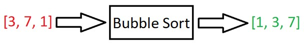

</Image>
</center>

:::note ÖRNEK

Gerçek dünyadan örnek verecek olursak; telefon rehberinin alfabetik olarak sıralanmış olması, ya da telefondaki dosyaların eklenme zamanına göre sıralanması şeklinde düşünebiliriz.

:::

:::info NOT

Bu algoritma büyük veri setleriyle çalışmak için uygun değildir. Büyük veri setlerinde en kötü durum (worst case) ve ortalama durumda (average case) zaman karmaşıklığı oldukça büyüktür.

:::

<details>
  <summary>
    <b>Stable</b>, <b>In-Place</b> ve <b>Karşılaştırılmalı (Comparison-Type)</b>{' '}
    Nedir?
  </summary>
  <div>
    <details>
      <summary>
        <b>Stable</b>
      </summary>
      <div>
        Eşit değerlere sahip iki öğenin henüz sıralanmamış olan girdide nasıl
        görünüyorlarsa sıralandıktan sonra bu iki eşit değerin çıktıda aynı
        sırada görünmesidir.
        <br />
        <br />
        <b>Örneğin,</b> eğer şu array’i sıralamak istersek;
        <br />
        <br />
        <code>[“Ceviz”, “Böğürtlen”, “Armut”, “Beyaz Dut”]</code>
        <br />
        <br />
        Kelimlerin ilk harflerine göre alfabetik olarak sıralarsak çıktı şu şekilde
        olur:
        <br />
        <br />
        <code>[“Armut”, “Böğürtlen”, “Beyaz Dut”, “Ceviz”]</code>
        <br />
        <br />
        Görüldüğü üzere “Böğürtlen” ve “Beyaz Dut” değerleri girdide göreceli (relative)
        pozisyonu ne ise çıktıda da bu pozisyonu korumaya devam ettiler. İşte <b>
          stable
        </b> kelimesinin anlamı budur.
        <br />
        <br />
        <a href="https://cs-space.vercel.app/algorithms/sorting-algorithms/bubble-sort">
          Bubble Sort
        </a>
        ,{' '}
        <a href="https://cs-space.vercel.app/algorithms/sorting-algorithms/merge-sort">
          Merge Sort
        </a>{' '}
        ve{' '}
        <a href="https://cs-space.vercel.app/algorithms/sorting-algorithms/radix-sort">
          Radix Sort
        </a>{' '}
        stable algoritmalardır.
      </div>
    </details>
    <details>
      <summary>
        <b>In-Place</b>
      </summary>
      <div>
        Wikipedia’ya göre in-place şu demektir: “Hiçbir auxiliary (yardımcı)
        veri yapısı kullanmadan girdiyi dönüştüren algoritmadır. Ama yardımcı
        (auxiliary) değişkenler için az miktarda ekstra depolama alanına izin
        verir.”
        <br />
        <br />
        Bu tanımı daha da basitleştirirsek; algoritmanın çalışma zamanında ekstra
        bir değişkene ihtiyaç duymadan çıktıyı elde etmek için input’un üzerinde
        çıktıyı hazırlamaktır. In-place algoritmalarının avantajı, bellekte daha
        az yer kaplamalarıdır.
      </div>
    </details>
    <details>
      <summary>
        <b>Comparison Sort (Karşılaştırılmalı Sıralama)</b>
      </summary>
      <div>
        Bir listenin elementlerinin hangisinin önce gelmesini belirlemek için
        karşılaştırma operatörlerinin kullanılarak sıralanmasını sağlayan bir
        sıralama algoritmasıdır.
      </div>
    </details>
  </div>
</details>

## Bubble Sort Algoritması Nasıl Çalışır?

Girdi olarak bir array alır. Bu array üzerinde döngü yaparak çalışır ve mevcut elemanı yanındaki elemanla karşılaştırır. Bu karşılaştırmada iki elemanın da sırası yanlışsa mevcut eleman yanındaki elemanla yer değiştirir. Bu uygulamada en büyük eleman yukarı (sona) doğru ilerler. Girdideki array sıralanana kadar bu uygulama devam eder.

Aşağıdaki array’i sıralamak istediğimizi düşünelim:

<Image copyRight="CopyRight">

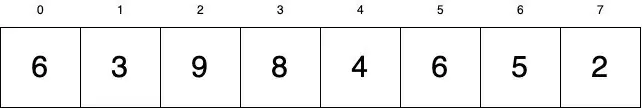

</Image>

Bu array’i artan sıraya göre sıralamak istiyoruz.

Daha önce de anlattığımız gibi, Bubble Sort’ta bir array üzerinde elemanlar doğru yerlerde olana kadar döngü yaparız. Elemanların doğru yerlerde olmasını sağlamak için değerleri değiş tokuş ederiz. Array üzerinde döngü uygularken mevcut elemanın yanındaki elemandan büyük mü olduğunu kontrol ederiz. Eğer mevcut eleman yanındaki elemandan büyükse bu iki elemanı in-place olarak değiş tokuş (swap) ederiz.

:::info NOT

Bu değiş tokuşları in-place olarak yapmak çok önemlidir. Bubble Sort algortimasını uygularken ekstra hafıza kullanmayız.

:::

Daha sonra bütün array elemanları üzerinde geziniriz. Döngü sırasında herhangi bir değiş tokuşun (swap) olup olmadığını kontrol ederiz. Eğer swap işlemi bittiyse elemanların sıralandığından emin olmak için array üzerinde tekrar yineleme yaparız. Eğer değerler hala doğru yerde değilse tekrar swap işlemi uygularız. Elemanlar tamamen sıralanana ve swap işlemine ihtiyaç olmayana kadar yine array’deki bütün elemanları geziniriz.

**1)** İlk aşamada array’imizin ilk elemanından başlarız. Şu anki mevcut değer: **6**

<div style={{width:"70%"}}>
<center><b>6 > 3 mü?</b></center>
<Image copyRight="CopyRight">

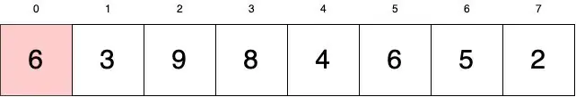

</Image>
</div>
Evet, 6 sayısı 3’ten büyüktür. Bu nedenle bu iki sayıyı değiş tokuş yaparız.

<br />
<br />

**2)**

<div style={{width:"70%"}}>
<Image copyRight="CopyRight">

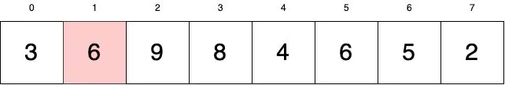

</Image>
</div>

Şu anda mevcut değerimizin konumu 1’dir. Şimdi mevcut değerimiz ile yanındaki elemanı az önceki gibi karşılaştıralım:

**6 > 9 mü?**

Hayır, 6 sayısı 9’dan büyük değildir. Bu nedenle 6 sayısı olduğu yerde kalır ve mevcut değerimizin değerini 9 olarak değiştiririz (döngüye devam ederiz).

**3)**

<div style={{width:"70%"}}>
<center><b>9 > 8 mü?</b></center>
<Image copyRight="CopyRight">

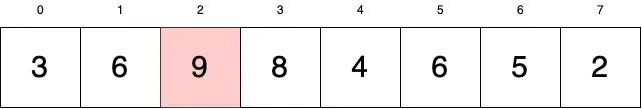

</Image>
</div>

Evet, o zaman bu iki sayıyı swap’layalım.

**4)**

<div style={{width:"70%"}}>
<center><b>9 > 4 mü?</b></center>
<Image copyRight="CopyRight">

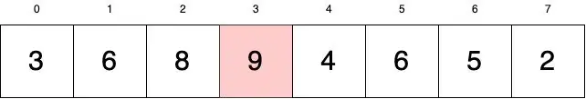

</Image>
</div>
Evet, o zaman bu iki sayıyı swap’layalım.

<br />
<br />

**5)**

<div style={{width:"70%"}}>
<center><b>9 > 6 mı?</b></center>
<Image copyRight="CopyRight">

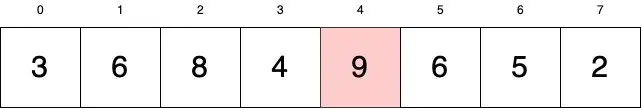

</Image>
</div>
Evet, o zaman bu iki sayıyı swap’layalım.

<br />
<br />

**6)**

<div style={{width:"70%"}}>
<center><b>9 > 5 mi?</b></center>
<Image copyRight="CopyRight">

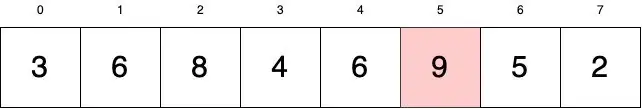

</Image>
</div>
Evet, o zaman bu iki sayıyı swap’layalım.

<br />
<br />

**7)**

<div style={{width:"70%"}}>
<center><b>9 > 2 mi?</b></center>
<Image copyRight="CopyRight">

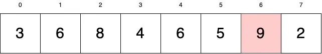

</Image>
</div>
Evet, o zaman bu iki sayıyı swap’layalım.

<br />
<br />

**8)**

<div style={{width:"70%"}}>
<Image copyRight="CopyRight">

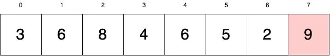

</Image>
</div>

İlk turda 9 sayısından sonra karşılaştırılması gereken bir değer kalmadı. Şu anda 9 sayısı ulaşabildiği en son noktaya ulaştı.

Bu noktada array üzerindeki ilk yinelememizi tamamladık. Kendimize soralım: Şimdiye kadar olan yinelemelerde herhangi bir swap işlemi gerçekleştirdik mi? Evet, çok fazla swap işlemi yaptık. Bu durumda geriye dönüp sıralama işleminin tamamlanıp tamamlanmadığını görmek için array’i kontrol edeceğiz. Yukarıdaki gösterimde sıralama işleminin tamamlanmadığını görüyoruz ama bunu uyguladığımız kodda bilmenin yolu swap işlemini takip etmekten geçiyor.

**9)**
Aşağıdaki gösterimde sıralanmış olan değerler mavi renktedir. Artık sıralanmış olan bu değerler üzerinde çalışmamız gerekmiyor. Şimdi array’deki sıralananlar hariç öğelerin üzerinden tekrar geçelim. Bir sonraki mevcut değerimiz en baştaki öğedir. Yani mevcut değerimiz **3**’tür.

<div style={{width:"70%"}}>
<center><b>3 > 6 mı?</b></center>
<Image copyRight="CopyRight">

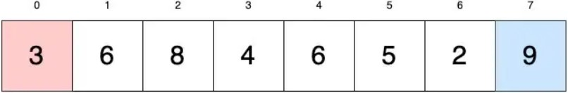

</Image>
</div>
Hayır, hiç bir işlem yapmadan bir sonraki sayıya geçelim (1. index).

<br />
<br />

**10)**

<div style={{width:"70%"}}>
<center><b>6 > 8 mi?</b></center>
<Image copyRight="CopyRight">

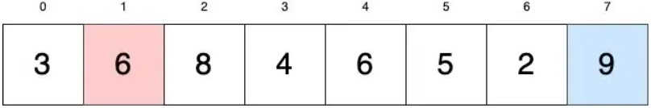

</Image>
</div>
Hayır, hiç bir işlem yapmadan bir sonraki sayıya geçelim (2. index).

<br />
<br />

**11)**

<div style={{width:"70%"}}>
<center><b>8 > 4 mü?</b></center>
<Image copyRight="CopyRight">

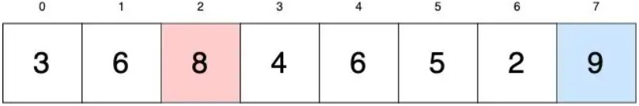

</Image>
</div>
Evet, o zaman bu iki sayıyı swap’layalım.
<br/><br/>
Görüldüğü gibi 8 sayısı (sıralanmış olan 9 sayısı hariç) sağındaki bütün değerlerden büyüktür. Bu nedenle 8 sayısı iterasyonu tamamlayıp 9’a gelene kadar sağında kalan her değer ile yer değiştirecek. Bu işlemi tamamlayarak birden çok swap işlemi gerçekleştirdik. Şimdi bir sonraki tura geçebiliriz.

<br />
<br />

**12)** Şu anki işlemler de önceki kısımda yaptığımız gibidir.

<div style={{width:"70%"}}>
<center><b>3 > 6 mı?</b></center>
<Image copyRight="CopyRight">

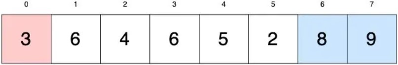

</Image>
</div>
Hayır, hiç bir işlem yapmadan bir sonraki sayıya geçelim (1. index).

<br />
<br />

**13)**

<div style={{width:"70%"}}>
<center><b>3 > 4 mü?</b></center>
<Image copyRight="CopyRight">

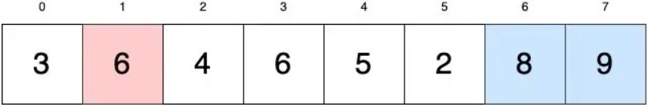

</Image>
</div>
Evet, o zaman bu iki sayıyı swap’layalım.

<br />
<br />

**14)**

<div style={{width:"70%"}}>
<center><b>6 > 6 mı?</b></center>
<Image copyRight="CopyRight">

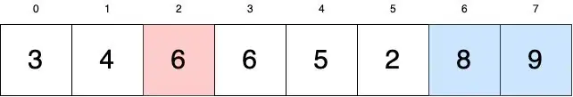

</Image>
</div>
Hayır, hiç bir işlem yapmadan bir sonraki sayıya geçelim (3. index).

<br />
<br />

**15)**

<div style={{width:"70%"}}>
<Image copyRight="CopyRight">

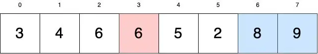

</Image>
</div>
Görüldüğü gibi mevcut değerimiz olan 6 sayısı sağındaki (daha önce sıralanmış olan 8 ve 9 hariç) tüm sayılardan büyüktür. Bu nedenle 3. index’te yer alan 6 sayısını 8’e kadar olan sayılarla swap’larız.

<br />
<br />

**16)** 6 sayısını 8’e kadar (6. index) sıraladığımıza göre tekrar başa dönebiliriz:

<div style={{width:"70%"}}>
<Image copyRight="CopyRight">


</Image>
</div>

**17)** 6 sayısı da sıralandığına göre diğer tur şu şekilde gerçekleşir:

<div style={{width:"70%"}}>
<Image copyRight="CopyRight">

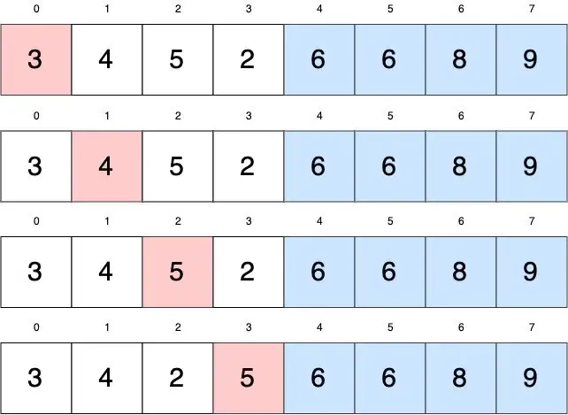

</Image>
</div>

**18)** 5 sayısı da sıralandı. Sıra şimdi diğer turda:

<div style={{width:"70%"}}>
<Image copyRight="CopyRight">

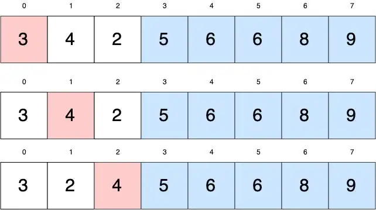

</Image>
</div>

**19)** 4 sayısı da sıralandı. Diğer tura geçebiliriz:

<div style={{width:"70%"}}>
<Image copyRight="CopyRight">

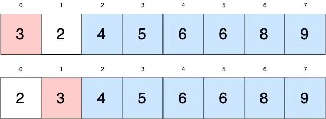

</Image>
</div>

**20)** Son tur kaldı:

<div style={{width:"70%"}}>
<Image copyRight="CopyRight">

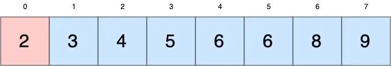

</Image>
</div>

2 sayısı hiç bir sayı ile yer değiştirmez. Böylece bu turda swap işlemi gerçekleşmez. Bu, sıralama işlemini tamamladığımız anlamına gelir.

Bubble Sort algoritmasının nasıl çalıştığını adım adım anlattık. Şimdi bu anlattıklarımızı bir animasyon üzerinde pekiştirelim:

<div style={{width:"70%"}}>
<Image copyRight="CopyRight">


</Image>
</div>

Ayrıca [visualgo](https://visualgo.net/en/sorting?slide=1) web sitesinde de bu algoritmayı inceleyebilir, farklı veriler üzerinde çalışabilirsiniz.

Mantığı iyi bir şekilde kavradıktan sonra kod ile nasıl uygulamamız gerektiğinden bahsedelim:

## Bubble Sort Algoritmasını Uygulamak

Önce sözde koda (pseudocode) yer vereceğiz. Dilerseniz bu sözde kodu inceleyerek hangi dilde uygulamak istiyorsanız o şekilde kodunuzu yazabilir, kendizi deneyebilirsiniz. Ya da direkt çözümü inceleyebilirsiniz.

### Bubble Sort Algoritmasının Sözde Kodu

<ol>
  <li>
    <code>swapped</code> adında bir değişken oluşturun.
  </li>
  <li>
    Array üzerinde <code>i</code> adında bir değişken ile döngü oluşturun. Bu
    döngü array’in son elemanından başlasın ve array’in başlangıcına kadar
    sürsün.
  </li>
  <li>
    swapped değişkenine true değerini atayın. Böylelikle iterasyonda swap işlemi
    gerçekleşip gerçekleşmediğini takip edebileceğiz
  </li>
  <li>
    Dış döngünün içinde <code>j</code> adında bir değişken ile bir döngü daha
    oluşturun. Bu iç döngü array’in başlangıcından dış döngünün bir eksiğine
    kadar sürsün.
  </li>
  <li>
    Eğer <code>array[j] > array[j + 1]</code> ise bu iki değeri swap edin.
    Ayrıca swapped değişeninin değerini false olarak ayarlayın. Bu işlemi döngü
    bitene kadar devam ettirin.
  </li>
  <li>Döngüler bittikten sonra sıralanan array’i return edin.</li>
</ol>

### Bubble Sort Algoritmasının Kod İle Uygulanması

```mdx-code-block
<Tabs>
<TabItem value="c" label="C" default>
```

```c
#include <stdio.h>
#include <stdbool.h>

void swap(int *xp, int *yp)
{
    int temp = *xp;
    *xp = *yp;
    *yp = temp;
}
 void bubbleSort(int arr[], int n)
{
   int i, j;
   bool swapped;

   for (i = 0; i < n-1; i++)
   {
     swapped = false;

     for (j = 0; j < n-i-1; j++)
     {
        if (arr[j] > arr[j+1])
        {
           swap(&arr[j], &arr[j+1]);
           swapped = true;
        }
     }

     // Eğer iç döngüde swap edilecek iki değer yoksa iç döngüyü sonlandır
        if (swapped == false)
        break;
   }
}

/* Array’i yazdırmak için fonksiyon */
void printArray(int arr[], int size)
{
    int i;
    for (i=0; i < size; i++)
        printf("%d ", arr[i]);
}

// Yukarıdaki fonksiyonları test etmek için:
int main()
{
    int arr[] = {64, 34, 25, 12, 22, 11, 90};
    int n = sizeof(arr)/sizeof(arr[0]);

    bubbleSort(arr, n);
    printf("Sıralanmış array: \n");
    printArray(arr, n);

    return 0;
}
```

```mdx-code-block
</TabItem>
<TabItem value="cpp" label="C++">
```

```cpp
#include <bits/stdc++.h>
using namespace std;

void bubbleSort(int arr[], int n)
{
   int i, j;
   bool swapped;

   for (i = 0; i < n-1; i++)
   {
     swapped = false;

     for (j = 0; j < n-i-1; j++)
     {
        if (arr[j] > arr[j+1])
        {
           swap(arr[j], arr[j+1]);
           swapped = true;
        }
     }

     // Eğer iç döngüde swap edilecek iki değer yoksa iç döngüyü sonlandır
     if (swapped == false)
        break;
   }
}

// Array’i yazdırmak için fonksiyon
void printArray(int arr[], int size)
{
    int i;

    for (i = 0; i < size; i++)
        cout <<" "<< arr[i];
}

// Yukarıdaki fonksiyonları test etmek için:
int main()
{
    int arr[] = {64, 34, 25, 12, 22, 11, 90};
    int N = sizeof(arr)/sizeof(arr[0]);

    bubbleSort(arr, N);
    cout <<"Sıralanmış array: \n";
    printArray(arr, N);

    return 0;
}
```

```mdx-code-block
</TabItem>
<TabItem value="java" label="Java">
```

```java
import java.io.*;

class GFG
{
    static void bubbleSort(int arr[], int n)
    {
        int i, j, temp;
        boolean swapped;

        for (i = 0; i < n - 1; i++)
        {
            swapped = false;

            for (j = 0; j < n - i - 1; j++)
            {
                if (arr[j] > arr[j + 1])
                {
                    // swap arr[j] and arr[j+1]
                    temp = arr[j];
                    arr[j] = arr[j + 1];
                    arr[j + 1] = temp;
                    swapped = true;
                }
            }

            // Eğer iç döngüde swap edilecek iki değer yoksa iç döngüyü sonlandır
            if (swapped == false)
                break;
        }
    }

    // Array’i yazdırmak için fonksiyon
    static void printArray(int arr[], int size)
    {
        int i;

        for (i = 0; i < size; i++)
            System.out.print(arr[i] + " ");
            System.out.println();
    }

    // Yukarıdaki fonksiyonları test etmek için:
    public static void main(String args[])
    {
        int arr[] = { 64, 34, 25, 12, 22, 11, 90 };
        int n = arr.length;

        bubbleSort(arr, n);
        System.out.println("Sıralanmış array: ");
        printArray(arr, n);
    }
}
```

```mdx-code-block
</TabItem>
<TabItem value="python" label="Python">
```

```python
import java.io.*;

class GFG
{
    static void bubbleSort(int arr[], int n)
    {
        int i, j, temp;
        boolean swapped;

        for (i = 0; i < n - 1; i++)
        {
            swapped = false;

            for (j = 0; j < n - i - 1; j++)
            {
                if (arr[j] > arr[j + 1])
                {
                    // swap arr[j] and arr[j+1]
                    temp = arr[j];
                    arr[j] = arr[j + 1];
                    arr[j + 1] = temp;
                    swapped = true;
                }
            }

            # Eğer iç döngüde swap edilen iki değer yoksa iç döngüyü sonlandır
            if (swapped == false)
                break;
        }
    }

    # Array’i yazdırmak için fonksiyon
    static void printArray(int arr[], int size)
    {
        int i;
        for (i = 0; i < size; i++)
            System.out.print(arr[i] + " ");
        System.out.println();
    }

    # Yukarıdaki fonksiyonları test etmek için:
    public static void main(String args[])
    {
        int arr[] = { 64, 34, 25, 12, 22, 11, 90 };
        int n = arr.length;

        bubbleSort(arr, n);
        System.out.println("Sıralanmış array: ");
        printArray(arr, n);
    }
}
```

```mdx-code-block
</TabItem>
<TabItem value="javascript" label="Javascript">
```

```javascript
function bubbleSort(arr, n) {
  var i, j, temp;
  var swapped;

  for (i = 0; i < n - 1; i++) {
    swapped = false;

    for (j = 0; j < n - i - 1; j++) {
      if (arr[j] > arr[j + 1]) {
        // arr[j] ve arr[j+1]’i swap et
        temp = arr[j];
        arr[j] = arr[j + 1];
        arr[j + 1] = temp;
        swapped = true;
      }
    }

    // Eğer iç döngüde swap edilecek iki değer yoksa iç döngüyü sonlandır
    if (swapped == false) break;
  }
}

// Array’i yazdırmak için fonksiyon
function printArray(arr, size) {
  var i;

  for (i = 0; i < size; i++) document.write(arr[i] + ' ');
  document.writeln();
}

// Yukarıdaki fonksiyonları test etmek için:
var arr = [64, 34, 25, 12, 22, 11, 90];
var n = arr.length;

bubbleSort(arr, n);
document.write('Sıralanmış array: ');
printArray(arr, n);
```

```mdx-code-block
</TabItem>
</Tabs>
```

**Çıktı**

```
Sıralanmış array:
11 12 22 25 34 64 90
```

## Bubble Sort Algoritması Performansı

### Time Complexity (Zaman Karmaşıklığı)

#### Best Case (En İyi Durum)

Eğer girdideki array hemen hemen sıralı bir şekildeyse ve sadece bir kere swap için elemanların üzerinden geçilecekse Bubble Sort algoritmasında en iyi durum gerçekleşir. İlk tur için iç döngünün tamamlanmasıyla birlikte bir sonraki turda döngüler sona erer. Bu nedenle Bubble Sort algoritması için en iyi durum **O(n) (doğrusal çalışma süresi)** diyebiliriz. Buradaki “n” array’in boyutunu (eleman miktarı) temsil eder.

<div style={{backgroundColor:"white",width:"60%"}}>
<Image copyRight="CopyRight">

.svg>)

</Image>
</div>

#### Worst Case (En Kötü Durum)

Eğer girdideki array tamamen sırasız bir şekildeyse (örneğin tersine sıra) Bubble Sort algoritması için en kötü durum senaryosu oluşur.

Array’de n adet eleman vardır. Her eleman için n adet karşılaştırma işlemi yapılır. Bu **n \* n = n^2** işlem demektir. Buradaki ikinci n, iterayonu ifade eder. Bunu Big-O notasyonda ifade edecek olursak; Bubble Sort algoritmasının en kötü durum senaryosu **O(n^2)**’dir.

<div style={{backgroundColor:"white",width:"60%"}}>
<Image copyRight="CopyRight">

.svg>)

</Image>
</div>

#### Average Case (Ortalama Durum)

Average case senaryosunda; eğer elemanlar array içerisinde rastgele dağıtılmışsa Bubble Sort algoritmasında n/2 oranında elemanların üzerinden geçilebilir ve her eleman için O(n) oranında karşılaştırılma yapılabilir. Bunu Big-O notasyonunda ifade edersek; Bubble Sort algoritmasının ortalama durum senaryosu **O((n / 2) \* n) = O(n^2 / 2)**’dir. Bunu sadeleştirirsek **O(n^2)** şeklinde ifade edebiliriz.

<div style={{backgroundColor:"white",width:"60%"}}>
<Image copyRight="CopyRight">

.svg>)

</Image>
</div>

#### Space Complexity (Alan Karmaşıklığı)

Bubble Sort algoritmasının alan karmaşıklığını **O(1)** olarak ifade ederiz. Çünkü sadece iki ek bellek alanı gereklidir: Bunlar <code>i</code> ve <code>j</code> isimlerindeki iki adet döngü değişkenidir. Giriş array’inin uzunluğu önemli değildir. Bellekte <code>i</code> ve <code>j</code> olmak üzere saklanması gereken sadece iki değişken olacak. (swapped adındaki değişkeni kullanıyorsak bellekte üç adet değiken bulunur. Bu değişkenler sabit alan kaplar.)

## Bubble Sort Algoritması Özet Tablosu

<table>
  <tbody>
    <tr>
      <td>
        <strong>Time Complexity (Best Case)</strong>
      </td>
      <td>O(n)</td>
    </tr>
    <tr>
      <td>
        <strong>Time Complexity (Average Case)</strong>
      </td>
      <td>O(n^2)</td>
    </tr>
    <tr>
      <td>
        <strong>Time Complexity (Worst Case)</strong>
      </td>
      <td>O(n^2)</td>
    </tr>
    <tr>
      <td>
        <strong>Space Complexity</strong>
      </td>
      <td>O(1)</td>
    </tr>
    <tr>
      <td>
        <strong>In-Place / Out-Of-Place?</strong>
      </td>
      <td>In-Pace</td>
    </tr>
    <tr>
      <td>
        <strong>Stability?</strong>
      </td>
      <td>Stable</td>
    </tr>
    <tr>
      <td>
        <strong>Karşılaştırılmalı Sıralama (Comparison Sort)?</strong>
      </td>
      <td>Karşılaştırılmalı (Comparison)</td>
    </tr>
  </tbody>
</table>

<!--- Content - End --->

<!--- Links Source - Start --->

## Kaynaklar Baglantisi

:::info Kaynaklar Bağlantısı

<Tabs>
  <TabItem value="youtube-videos" label="Youtube videoları" default>
    <ul>
      <li>
        <a href="https://www.youtube.com/watch?v=wiNIQ_lT3fk">
          Bubble Sort (Kabarcık / Baloncuk Sıralması) Algoritma Analizi 5
        </a>
      </li>
      <li>
        <a href="https://www.youtube.com/watch?v=Cq7SMsQBEUw">
          Bubble Sort Visualize
        </a>
      </li>
    </ul>
  </TabItem>
  <TabItem value="blog-article" label="Blog & Makale">
    <ul>
      <li>
        <a href="https://tsafaelmali.medium.com/bubble-sort-algoritmas%C4%B1-nedir-9811bd921b8d">
          Algoritma — Bubble Sort Algoritması Nedir?
        </a>
      </li>
      <li>
        <a href="https://bilgisayarkavramlari.com/2008/08/09/kabarcik-siralamasi-baloncuk-siralamasi-bubble-sort/">
          Kabarcık Sıralaması (Baloncuk sıralaması, Bubble Sort)
        </a>
      </li>
    </ul>
  </TabItem>
  <TabItem value="questions" label="Sorular">
    <ul>
      <li>
        <a href="https://practice.geeksforgeeks.org/problems/bubble-sort/1">
          Bubble Sort | Practice | GeeksforGeeks
        </a>
      </li>
      <li>
        <a href="https://www.hackerearth.com/practice/algorithms/sorting/bubble-sort/practice-problems/algorithm/bubble-sort-15-8064c987/">
          Bubble Sort | Practice Problems
        </a>
      </li>
      <li>
        <a href="https://www.geeksforgeeks.org/quiz-bubblesort-gq/">
          Bubble Sort - Questions
        </a>
      </li>
    </ul>
  </TabItem>
</Tabs>

:::

<!--- Links Source - End --->
