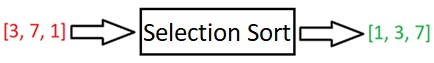
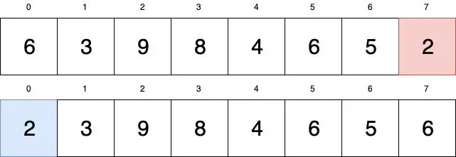
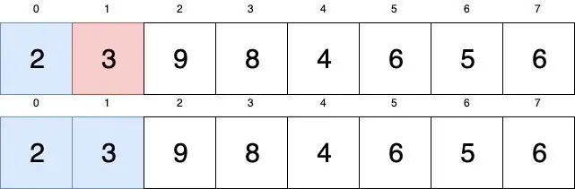
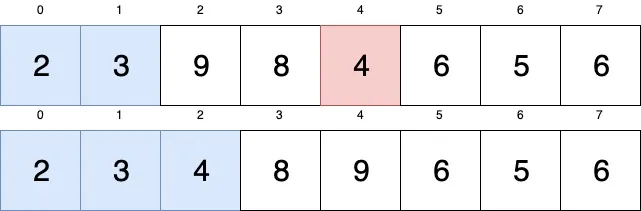
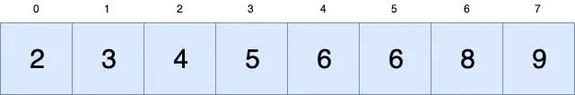

# Selection Sort

<!--- Import Component Here --->

import NoContentHere from '@site/src/components/MDX/NoContentHere';
import Tabs from '@theme/Tabs';
import TabItem from '@theme/TabItem';

<!--- Content - Start --->

**Selection Sort** algoritması, bir dizinin henüz sıralanmamış kısımdaki en küçük elemanını bulur. Bulunan bu en küçük elemanı dizinin başına koyar. Dizi tamamen sıralanana kadar bu işlemleri tekrar ederek çalışan algoritmadır.

<center>
<Image copyRight="CopyRight">



</Image>
</center>

Selection Sort algoritması verilen dizide iki subarray (alt dizi) tutar:

- Önceden sıralanmış subarray
- Kalan sıralanmamış subarray

Selection Sort algoritmasında her yinelemede sıralanmamış subrarray’deki en küçük eleman seçilir. Seçilen bu eleman sıralanmamış subarray’in başına doğru hareket eder.

Her iterasyon yinelemesinden sonra sıralanmış subarray’in boyutu bir artarken, sıralanmamış subarray’in boyutu bir azalır.

N (dizi boyutu) adet iterasyondan sonra verilen dizi sıralanmış olur.

:::note NOT
Selection Sort **in-place**, **unstable** ve **comparison-type (karşılaştırılmalı)** türündeki bir algoritmadır.
:::

<details>
  <summary>
    <b>In-Place</b>, <b>Unstable</b> ve <b>Comparison Sort</b> Nedir?
  </summary>
  <div>
    <details>
      <summary>
        <b>In-Place</b>
      </summary>
      <div>
        Wikipedia’ya göre in place şu demektir: “Hiçbir auxiliary (yardımcı)
        veri yapısı kullanmadan girdiyi dönüştüren bir algoritmadır. Ama
        yardımcı (auxiliary) değişkenler için az miktarda ekstra depolama
        alanına izin verir.”
        <br />
        <br />
        Bu tanımı daha da basitleştirirsek; algoritmanın çalışma zamanında ekstra
        bir değişkene ihtiyaç duymadan çıktıyı elde etmek için input’un üzerinde
        çıktıyı hazırlamaktır. In-place algoritmalarının avantajı, bellekte daha
        az yer kaplamalarıdır.
      </div>
    </details>
    <details>
      <summary>
        <b>Unstable</b>
      </summary>
      <div>
        Eşit değerlere sahip iki öğenin henüz sıralanmamış olan girdideki
        görünümüyle sıralandıktan sonra bu iki eşit değerin çıktıda farklı
        sırada görümesidir.
        <br />
        <br />
        <b>Örneğin</b>, eğer şu array’i sıralamak istersek;
        <br />
        <br />
        <b>[“Ceviz”, “Böğürtlen”, “Armut”, “Beyaz Dut”]</b>
        <br />
        <br />
        Kelimlerin ilk harflerine göre alfabetik olarak sıralarsak çıktı şu şekilde
        olur:
        <br />
        <br />
        <b>[“Armut”, “Beyaz Dut”, “Böğürtlen”, “Ceviz”]</b>
        <br />
        <br />
        Görüldüğü üzere <b>“Böğürtlen”</b> ve <b>“Beyaz Dut”</b> değerleri girdideki
        göreceli (relative) pozisyonu ile çıktıdaki pozisyonu korumadılar. İşte unstable
        algoritmaları bu şekilde çalışır..
      </div>
    </details>
    <details>
      <summary>
        <b>Comparison Sort</b>
      </summary>
      <div>
        Bir listenin elemanlarının hangisinin önce gelmesi gerektiğini
        belirlemek için karşılaştırma operatörlerinin kullanılarak sıralanmasını
        sağlayan bir sıralama algoritmasıdır.
      </div>
    </details>
  </div>
</details>

## Selection Sort Algoritması Nasıl Çalışır?

[Buble Sort](https://cs-space.vercel.app/algorithms/sorting-algorithms/bubble-sort) algoritmasını anlatırken kullandığımız array’i bu algoritmada da kullanalım:

<Image copyRight="CopyRight">


</Image>

Bu diziyi sıralama şeklimiz; girdiyi iki ayrı listeye bölmektir. İlk alt liste sıralanmış sayıları ifade ederken, ikinci alt liste henüz sıralanmamış olan sayıları ifade eder. Başlangıçta bütün dizimiz sıralanmamış listeyi ifade eder.

İlk önce dizimizdeki en küçük elemanı bulabilmek için dizimizi dolaşırız. En küçük elemanı bulduğumuzda, bu elemanı sıralanmış listeye ekleriz (dizinin en başı). Bu ekleme olayı verilen dizide in-place şeklinde gerçekleşir.

<Image copyRight="CopyRight">



</Image>

Takas (swap) işleminden sonra diziyi tekrar kontrol edersek; 0. indeksteki elemanın dizinin en küçük elemanı olduğunu fark ederiz.

Şimdi dizide yineleme yapmaya devam ederiz. Bu yinelemede sıralanmış subarray’den (mavi kısım) sonraki kısımdan başlarız. Sıralanmamış subarray’deki (beyaz kısım) en küçük elemanı bulana kadar dizide yineleme yaparız. En küçük olarak varsaydığımız eleman ondan sonra gelen elemandan büyükse bu varsayımı güncelleriz. Yani, eğer en küçük sayı = 3 ise ve ondan sonra gelen sayı 9 ise, 3 sayısının 9’dan küçük olduğunu görürüz ve en küçük sayı varsayımı hala 3’tür. 9’dan sonra gelen sayıları da aynı şekilde 3 ile karşılaştırırız. Eğer 3 sayısından daha küçük bir elemana denk gelinirse yeni en küçük sayımız o sayı olacaktır. Yani bunu şu şekilde somutlaştırırsak;

3 > 9 ?
Hayır, hiç bir şey yapma. Sadece dizide ilerle.

3 > 8 ?
Hayır, hiç bir şey yapma. Sadece dizide ilerle.

3 > 4 ?
Hayır, hiç bir şey yapma. Sadece dizide ilerle.

3 > 6 ?
Hayır, hiç bir şey yapma. Sadece dizide ilerle.

3 > 5 ?
Hayır, hiç bir şey yapma. Sadece dizide ilerle.

3 > 6 ?
Hayır, hiç bir şey yapma. Dizinin sonuna ulaştık.

Bu yinelemede sıralanmamış kısımdaki en küçük sayı varsayımımız hala 3’tür. Demek ki 3 sayısı dizide doğru yerdedir. O nedenle herhangi bir swap işlemi yapmayız.

<Image copyRight="CopyRight">



</Image>

Sıradaki yineleme 2. indeskten başlar.

<Image copyRight="CopyRight">



</Image>

Şu an ele aldığımız en küçük sayı varsayımımız 9’dur. Aynı zamanda bu 9 sayısının index numarasını dizide bulacağımız 9’dan küçük sayı ile swap için akılda tuttuk..

9’dan küçük bir sayıya denk gelene kadar dizideki sıralanmamış kısımdaki elemanları 9 ile karşılaştırarak (9 > x ?) ilerleriz. 9 > 8 mi? Evet. Şu anki en küçük sayımız 8’dir. Bu şekilde ilerlerken dizideki 4. indekste yer alan 4 sayısının 8’den küçük olduğunu görürüz. Şu anki en küçük sayı varsayımımız 4’tür. Bundan sonra kalan diğer sayıları ile 4 ile karşılaştırırız. Dizinin sonuna ulaştığımızda en küçük sayımız 4’tür. Bu nedenle başlangıçta atanan 9 (2. index) ile dizideki en küçük elaman olan 4 (4. index) sayılarını swap (değiş tokuş) ederiz.

Verilen diziyi tamamen sıralayana kadar sıralanmış subarray’in (mavi kısım) boyutunu yukarıdaki işlemleri takrarlayarak arttırmaya devam ederiz. En son dizinin sıralanmış hali şu şekildedir:

<Image copyRight="CopyRight">



</Image>

## Selection Sort Algoritmasını Uygulamak

Önce sözde koda (pseudocode) yer vereceğiz. Dilerseniz bu sözde kodu inceleyerek hangi dilde uygulamak istiyorsanız o şekilde kodunuzu yazabilir, kendizi deneyebilirsiniz. Ya da hemen çözümü inceleyebilirsiniz.

### Selection Sort Algoritmasının Sözde Kodu

<ol>
  <li>Dizideki ilk elemanı en küçük eleman olarak bir değişkende tut.</li>
  <li>
    Belirlenen bu en küçük elemandan daha küçük bir öğe bulana kadar
    varsayımdaki eleman ile ile sonraki elemanı karşılaştır.
  </li>
  <li>
    Eğer yeni bir küçük sayı bulunursa, bulunan bu sayıyı yeni küçük sayı olarak
    belirle ve dizideki en son elemana ulaşana kadar dizide gezinmeyi devam
    ettir.
  </li>
  <li>
    Bu işlemleri dizi tamamen sıralanana kadar diğer elemanda da aynı şekilde
    uygulamaya devam et.
  </li>
</ol>

### Selection Sort Algoritmasının Kod İle Uygulanması

```mdx-code-block
<Tabs>
<TabItem value="c" label="C" default>
```

```c
#include <bits/stdc++.h>
using namespace std;

// Swap fonksiyonu
void swap(int *xp, int *yp)
{
    int temp = *xp;
    *xp = *yp;
    *yp = temp;
}

void selectionSort(int arr[], int n)
{
    int i, j, min_idx;

    // Sıralanmamış subarray’i teker teker dolaş
    for (i = 0; i < n-1; i++)
    {

        // Sıralanmamış array’deki en küçük elemanı bul
        min_idx = i;

        for (j = i+1; j < n; j++)
        if (arr[j] < arr[min_idx])
            min_idx = j;

        // Bulunan en küçük sayı ile ilk elemanı swap et
        if(min_idx!=i)
            swap(&arr[min_idx], &arr[i]);
    }
}

// Array’i yazdırmak için fonksiyon
void printArray(int arr[], int size)
{
    int i;

    for (i=0; i < size; i++)
        cout << arr[i] << " ";

    cout << endl;
}

// Fonksiyonları test etmek için driven programı
int main()
{
    int arr[] = {64, 25, 12, 22, 11};
    int n = sizeof(arr)/sizeof(arr[0]);

    selectionSort(arr, n);
    cout << "Sıralanmış array: \n";
    printArray(arr, n);

    return 0;
}
```

```mdx-code-block
</TabItem>
<TabItem value="cpp" label="C++">
```

```cpp
#include <stdio.h>

void swap(int *xp, int *yp)
{
    int temp = *xp;
    *xp = *yp;
    *yp = temp;
}

void selectionSort(int arr[], int n)
{
    int i, j, min_idx;

    // Sıralanmamış subarray’i teker teker dolaş
    for (i = 0; i < n-1; i++)
    {
        // Sıralanmamış array’deki en küçük elemanı bul
        min_idx = i;

        for (j = i+1; j < n; j++)
          if (arr[j] < arr[min_idx])
            min_idx = j;

        // Bulunan en küçük sayı ile ilk elemanı swap et
           if(min_idx != i)
            swap(&arr[min_idx], &arr[i]);
    }
}

/* Array’i yazdırmak için fonksiyon */
void printArray(int arr[], int size)
{
    int i;

    for (i=0; i < size; i++)
        printf("%d ", arr[i]);
    printf("\n");
}

// Fonksiyonları test etmek için driven programı
int main()
{
    int arr[] = {64, 25, 12, 22, 11};
    int n = sizeof(arr)/sizeof(arr[0]);

    selectionSort(arr, n);
    printf("Sıralanmış array: \n");
    printArray(arr, n);

    return 0;
}
```

```mdx-code-block
</TabItem>
<TabItem value="java" label="Java">
```

```java
import java.io.*;
public class SelectionSort
{
    void sort(int arr[])
    {
        int n = arr.length;

        // Sıralanmamış subarray’i teker teker dolaş
        for (int i = 0; i < n-1; i++)
        {
            // Sıralanmamış array’deki en küçük elemanı bul
            int min_idx = i;
            for (int j = i+1; j < n; j++)
                if (arr[j] < arr[min_idx])
                    min_idx = j;

            // Bulunan en küçük sayı ile ilk elemanı swap et
            int temp = arr[min_idx];

            arr[min_idx] = arr[i];
            arr[i] = temp;
        }
    }

    // Array’i yazdır
    void printArray(int arr[])
    {
        int n = arr.length;

        for (int i=0; i<n; ++i)
            System.out.print(arr[i]+" ");
        System.out.println();
    }

    // Fonksiyonları test etmek için driven programı
    public static void main(String args[])
    {
        SelectionSort ob = new SelectionSort();
        int arr[] = {64,25,12,22,11};

        ob.sort(arr);
        System.out.println("Sıralanmış array");
        ob.printArray(arr);
    }
}
```

```mdx-code-block
</TabItem>
<TabItem value="python" label="Python">
```

```python
import sys
A = [64, 25, 12, 22, 11]

# Bütün array elemanlarını dolaş
for i in range(len(A)):

    # Geriye kalan sıralanmamış array’deki en küçük elemanı bul
    min_idx = i
    for j in range(i+1, len(A)):
        if A[min_idx] > A[j]:
            min_idx = j

    # Bulunan en küçük sayı ile ilk elemanı swap et
    A[i], A[min_idx] = A[min_idx], A[i]

# Fonksiyonları test etmek için driven programı
print ("Sıralanmış array")

for i in range(len(A)):
    print("%d" %A[i],end=" ")
```

```mdx-code-block
</TabItem>
<TabItem value="javascript" label="Javascript">
```

```javascript
function swap(arr, xp, yp) {
  var temp = arr[xp];
  arr[xp] = arr[yp];
  arr[yp] = temp;
}

function selectionSort(arr, n) {
  var i, j, min_idx;

  // Sıralanmamış subarray’i teker teker dolaş
  for (i = 0; i < n - 1; i++) {
    // Sıralanmamış array’deki en küçük elemanı bul
    min_idx = i;

    for (j = i + 1; j < n; j++) if (arr[j] < arr[min_idx]) min_idx = j;

    // Bulunan en küçük sayı ile ilk elemanı swap et
    swap(arr, min_idx, i);
  }
}

function printArray(arr, size) {
  var i;

  for (i = 0; i < size; i++) document.write(arr[i] + ' ');
  document.write(' <br>');
}

var arr = [64, 25, 12, 22, 11];
var n = 5;

selectionSort(arr, n);
document.write('Sıralanmış array: <br>');
printArray(arr, n);
```

```mdx-code-block
</TabItem>
</Tabs>
```

**Çıktı**
Sıralanmış array:
11 12 22 25 64

## Selection Sort Algoritması Performansı

### Time Complexity (Zaman Karmaşıklığı)

Şimdi Selection Sort Algoritması’nın zaman karmaşıklığındaki en iyi, ortalama ve en kötü senaryolarını tartışalım. Eğer Big-O Notasyon konusuna hakim değilseniz [buradan](https://cs-space.vercel.app/algorithms/analysis-of-algorithms/big-O-notation) öğrenebilirsiniz. Big-O konusu önemlidir ve verimli olmayan kod yazmanızın önüne geçer.

#### En İyi Durum (Best-Case) Senaryosu

Eğer array’deki elemanlar hemen hemen sıralıysa, örneğin; [2, 1, 3, 4], ya da tamamen sıralıysa array’deki her öğe için Selection Sort, takas gerekmese bile minimumu arayarak dizi boyunca çalışır.

Dizi sıralanmış olsa bile kabaca n \* n karşıalştırma gerçekleşir (buradaki n array’deki eleman sayısıdır).

Yani, en iyi durum senaryosunda O(n^2) karşılaştırma, O(1) takas işlemi (swap) gerçekleşir.

Tüm bunların anlamı, Selection Sort Algoritması’nın en iyi durum zaman karmaşıklığında çok kötü bir performans sergilemesidir (**O(n^2) - quadratic zaman karmaşıklığı)**.

<div style={{backgroundColor:"white",width:"60%"}}>
<Image copyRight="CopyRight">

.svg>)

</Image>
</div>

#### En Kötü Durum (Worst-Case) Senaryosu

Eğer verilen dizi tam tersi şekilde sıralıysa, örneğin; [4, 3, 2, 1], o zaman dizi neredeyse sıralanmış gibi birçok karşılaştırma gerektirecektir. – O(n^2). Ayrıca O(n) swap da olacaktır. Toplamda gerçekleşen senaryo O(n + n^2)’dir.

n^2 dikkate alınması gereken bir katsayıdır. Bu nedenle Selection Sort Algoritması’nın en kötü durum senaryosu **O(n^2) – quadratic zaman karmaşıklığı**.

<div style={{backgroundColor:"white",width:"60%"}}>
<Image copyRight="CopyRight">

.svg>)

</Image>
</div>

#### Ortalama Durum (Average-Case) Senaryosu

Selection Sort Algoritması array’deki elemanların sırası ne olursa olsun quadratic zaman karmaşıklığında çalışır. Karşılaştırma sayısı her zaman array’deki elemanların uzunluğudur. Buna rağmen eğer array’deki elemanlar tamamen sıralıysa daha az karşılaştırma gerçekleşir.

Kabaca; Selection Sort Algoritması’nın zaman karmaşıklığı **O(n^2)**’dir.

<div style={{backgroundColor:"white",width:"60%"}}>
<Image copyRight="CopyRight">

.svg>)

</Image>
</div>

### Space Complexity (Alan Karmaşıklığı)

Selection Sort bir in-place algoritmasıdır. Bunun anlamı, bu algoritma herhangi bir ekstra alana ihtiyaç duymamasıdır ve girişi (input) aynı bellekte “in-place” olarak dönüştürüp bu input’tan çıktı üretmesidir.

Ekstra veri yapısına ihtiyaç duymaz. Sadece hafızada depolanan bir kaç küçük tanımlanmış değişkenler alan karmaşıklığında göz önünde bulundurulabilir.Bu değişkenler;**i**,**j**,**lowest** dır.

Bu nedenle, Selection Sort Algoritması’nın alan karmaşıklığı **O(1)**’dir (**constant (sabit) alan karmaşıklığı**).

### Selection Sort Algortiması Ne Zaman Kullanılır?

Sadece tek bir durum Selection Sort Algoritması’nı diğer algoritmalarından ayırır: Selection Sort Algoritması’nda mümkün olan en az swap (değiş-tokuş) işlemi gerçekleşir. Bunu en kötü durum senaryosunda n − 1 şeklinde ifade ederiz.

Selection Sort Algoritması, [Bubble Sort Algoritması](https://cs-space.vercel.app/algorithms/sorting-algorithms/bubble-sort)’ndan daha iyi performans sergiler. Hatırlayın; Bubble Sort Algoritması’nda potansiyel olarak her değiş-tokuş işleminde karşılaştırma gerçekleşir. Bunu da n^2 şeklinde ifade edebiliriz. Herhangi bir nedenle hafızaya yazma konusunda çok endişeleniyorsanız, bu yararlı olabilir. Ancak yine de bir problemdir.

Selection Sort Algoritması’nın her zaman ve her durumda, array’deki elemanların sırasının önemi olmaksızın aynı performansı sergilemesi bir avantaj olsa da aynı zamanda da bir dezavantajdır: Array’deki elemanlar hemen hemen sıralanmışsa ve bu durum algoritmanın daha hızlı gerçekleştirmesi anlamına geliyorsa, bir algoritmanın performansında aynı orantıda değişiklik göstermesi genellikle daha iyidir. Bu nedenle bu tarz durumlarda [Insertion Sort Algortiması](https://cs-space.vercel.app/algorithms/sorting-algorithms/insertion-sort)’nı kullanmak iyi bir seçenek olacaktır.

Selection Sort Algoritma’sı ve Insertion Sort Algoritma’sının ikisi de küçük array girdilerinde (<20) çok hızlı çalışır. Yani, array girdisini kontrol etmek için faydalı bir optimizasyondur ve eğer array girdisinin boyutu küçükse Insertion Sort ya da Selection Sort Algoritmaları’nı uygulayabiliriz. Bunun haricinda eğer array boyutu daha büyükse de daha iyi verim için Merge Sort gibi Algoritma’ları kullanabiliriz.

## Özet

<table>
  <tbody>
    <tr>
      <td>
        <strong>Time Complexity (Best Case)</strong>
      </td>
      <td>O(n^2)</td>
    </tr>
    <tr>
      <td>
        <strong>Time Complexity (Average Case)</strong>
      </td>
      <td>O(n^2)</td>
    </tr>
    <tr>
      <td>
        <strong>Time Complexity (Worst Case)</strong>
      </td>
      <td>O(n^2)</td>
    </tr>
    <tr>
      <td>
        <strong>Space Complexity</strong>
      </td>
      <td>O(1)</td>
    </tr>
    <tr>
      <td>
        <strong>In-Place / Out-Of-Place?</strong>
      </td>
      <td>In-Pace</td>
    </tr>
    <tr>
      <td>
        <strong>Stability?</strong>
      </td>
      <td>Unstable</td>
    </tr>
    <tr>
      <td>
        <strong>Karşılaştırılmalı Sıralama (Comparison Sort)?</strong>
      </td>
      <td>Karşılaştırılmalı (Comparison)</td>
    </tr>
  </tbody>
</table>

<!--- Content - End --->

<!--- Links Source - Start --->

## Kaynaklar Baglantisi

:::info Kaynaklar Bağlantısı

<Tabs>
  <TabItem value="youtube-videos" label="Youtube videoları" default>
    <ul>
      <li>
        <a href="https://www.youtube.com/watch?v=tOa-RGkTSO0">
          Seçerek Sıralama (Selection Sort) (Algoritma Analizi 3)
        </a>
      </li>
      <li>
        <a href="https://www.youtube.com/watch?v=h3lcUana3ng">
          Selection Sort Konu Anlatımı
        </a>
      </li>
      <li>
        <a href="https://www.youtube.com/watch?v=UGABYQUEl1Q">
          Selection Sort - En Kolay Sıralama Algoritması
        </a>
      </li>
      <li>
        <a href="https://www.youtube.com/watch?v=AJKLcgsxfVQ">
          C Programlama Dersleri 39 - Selection Sort (Seçme Algoritması)
        </a>
      </li>
      <li>
        <a href="https://www.youtube.com/watch?v=9rJ0rpZ59G8">
          Selection Sort Algoritması Konu Anlatımı + C Kodu
        </a>
      </li>
    </ul>
  </TabItem>
  <TabItem value="blog-article" label="Blog & Makale">
    <ul>
      <li>
        <a href="https://medium.com/kodcular/selection-sort-algoritmas%C4%B1-nedir-484c40c9473c">
          Algoritma — Selection Sort Algoritması Nedir?
        </a>
      </li>
      <li>
        <a href="https://tr.wikipedia.org/wiki/Se%C3%A7meli_s%C4%B1ralama">
          Seçmeli Sıralama
        </a>
      </li>
    </ul>
  </TabItem>
  <TabItem value="questions" label="Sorular">
    <ul>
      <li>
        <a href="https://practice.geeksforgeeks.org/problems/selection-sort/1">
          Selection Sort - Practice
        </a>
      </li>
      <li>
        <a href="https://www.hackerearth.com/practice/algorithms/sorting/selection-sort/practice-problems/">
          Old keypad in a foreign land
        </a>
      </li>
      <li>
        <a href="https://www.sanfoundry.com/data-structure-questions-answers-selection-sort/">
          Data Structure Questions and Answers – Selection Sort
        </a>
      </li>
    </ul>
  </TabItem>
</Tabs>

:::

<!--- Links Source - End --->
