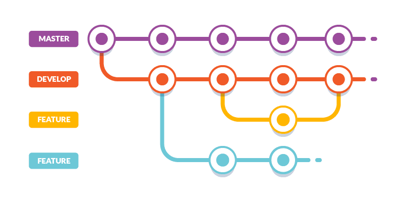

# Bilgisayar Bilimi Türkçe Kaynak Projesine Katkıda Bulunmak

import Image from '@site/src/components/MDX/Image';

Öncelikle, zaman ayırıp katkıda bulunduğunuz için teşekkürler! ❤️🎉👍

Açık Kaynak Kılavuzları web sitesinde, açık kaynaklı bir projeyi nasıl yürüteceklerini ve katkıda bulunacaklarını öğrenmek isteyen bireyler, topluluklar ve şirketler için bir dizi kaynak bulunur. Katkıda bulunanlar ve açık kaynağa yeni başlayanlar, aşağıdaki kılavuzları özellikle yararlı bulacaktır:

- [Açık Kaynağa Nasıl Katkıda Bulunulur](https://opensource.guide/tr/how-to-contribute/)
- [Misafirperver Topluluklar Oluşturma](https://opensource.guide/tr/building-community/)

:::info Ve projeyi beğendiyseniz, ancak katkıda bulunmak için zamanınız yoksa sorun değil. Projeyi desteklemenin ve takdirinizi göstermenin başka kolay yolları da var ki bu bizi çok mutlu edecektir:

- Projeyi yıldızlayarak favorilerine ekle
- Bu proje ile ilgili tweet at
- Projenizin README dosyasında bu projeye yer verin
- Yerel buluşmalarda projeden bahsedin ve arkadaşlarınıza/iş arkadaşlarınıza söyleyin

:::

## 👊 Davranış Kuralları

Bu projeye katılan herkes, [Fire Ocean Davranış Kuralları'ndan](./Code-Of-Conduct) sorumludur. Katıldığınızda, bu kodu desteklemeniz beklenir. Lütfen argo ve kaba davranışları ziarparvaiz@gmail.com bildirin .

## 👋 İletişim Kanalları

- Katkılar birçok yolla yapılabilir ve Github'a bağlı değildir. Projeyi çevrenize duyurarak da katkıda bulunabilirsiniz. Ayrıca, çözdüğünüz bir sorunla karşılaşabilecek diğer insanlara yardım ederek [Discord Topluluğumuza](https://discord.gg/bb-tr-kaynak) da katkıda bulunabilirsiniz.
- E-posta ile iletişim için <ziarparvaiz@gmail.com>.
- GitHub [Tartışmaları](https://github.com/Fire-Oceann/BB-TR-Kaynak/discussions)
- Twitter [ziarparvaiz](https://twitter.com/ziarparvaiz_01)

## 😎 Katkıda Bulunmak İstiyorum

:::note Yasal Uyarı

Bu projeye katkıda bulunurken, içeriğin %100'ünün size ait olduğunu, içerik üzerinde gerekli haklara sahip olduğunuzu ve katkıda bulunduğunuz içeriğin proje lisansı kapsamında sağlanabileceğini kabul etmelisiniz.

:::

`Bilgisayar Bilimi Türkçe Kaynak` projesine katkıda bulunmanın birçok yolu vardır ve bu yollardan bazıları herhangi bir kod yazmayı içermez. İşte başlamak için birkaç fikir:

- Geçici çözümler önererek veya düzelterek [açık konuları](https://github.com/Fire-Oceann/BB-TR-Kaynak/issues?q=is%3Aopen+is%3Aissue) çözmemize yardımcı olun.
- Düzeltmek istediğiniz bir sorun bulursanız, bir Pull Request açın. İlk sayı iyi olarak etiketlenen sorunlar, başlamak için iyi bir yerdir.
- [`Bilgisayar Bilimi Türkçe Kaynak` belgelerini baştan sona](../../algorithms) okuyun . Kafa karıştırıcı veya geliştirilebilecek bir şey bulursanız, doküman sayfasının alt kısmındaki "`Düzenle`"yi tıklayarak iyileştirmeler yapmaktan çekinmeyin.
- [Başkaları tarafından talep edilen özelliklere](https://github.com/Fire-Oceann/BB-TR-Kaynak/issues?q=is%3Aissue+is%3Aopen+label%3A%22%F0%9F%9A%80+feature%22) bir göz atın ve üzerinde çalışmak istediğiniz bir şey görürseniz bir PR atmayı düşünün.

### Branch Organizasyonu

`Bilgisayar Bilimi Türkçe Kaynak` projesinin iki ana dalı vardır: `prod`ve `develop`.

- `prod` : En son yayınlanan kodu içerir.
- `develop` : Gelişmenin gerçekleştiği yerdir.

<Image copyRight="rovitpm.com">

</Image>

:::danger

##### Tüm özellik branchlerinizin kökü her zaman `develop` branchi olmalıdır!

:::

### Semantik Taahhüt Mesajları

Git commit mesajlar ile alakalı daha detaylı bilgi için [`Semantic Commit Messages doküman`](./semantic-commit-messages/) sayfasına gidebilirseniz.

### Commit'ler ve Pull Request'ler

Nitelikli pull request'ler - yamalar, iyileştirmeler, yeni özellikler - bizim için harika yardımlardır. Bu yamalar, iyileştirmeler, yeni özellikler için pull request'ler yapılırken konuya (issue) odaklanılmalı ve konu ile ilgilisi olmayan commitler atmaktan kaçınılmalıdır.

### 🐞 Hatalar

Genel hatalarımız için [GitHub Template Sorunlarını](https://github.com/Fire-Oceann/BB-TR-Kaynak/issues/new/choose) kullanıyoruz . Bir sorunu bildirmek istiyorsanız, etrafınıza bir göz atın ve birisinin bu konuda bir sorun açıp açmadığına bakın. [Bunun yeni bildirilmemiş bir hata olduğundan eminseniz, bir hata raporu](https://github.com/Fire-Oceann/BB-TR-Kaynak/issues/new?assignees=&labels=%F0%9F%90%9B+bug&template=bug_report.yml&title=%5BBUG%5D+-+SORUNUN_BA%C5%9ELI%C4%9EINIZI_BURADAN_DE%C4%9E%C4%B0%C5%9ET%C4%B0R%C4%B0N) gönderebilirsiniz.

- Bir sorunla karşılaştığınızda: Lütfen sorun başına tek bir hata bildirin.
- Sorunla ilgili yeniden bildirme adımları: Sorunu yeniden oluşturmak için gerekli tüm adımları az ve öz kelimelerle listeleyin. Hata raporunuzu okuyan kişi, sorununuzu yeniden oluşturmak için bu adımları rahatlıkla takip edebilmelidir.

Yalnızca bir hatayı düzeltiyorsanız hemen bir Pull Request göndermeyin. Bir hata bulduysanız onu [issue raporu](https://github.com/Fire-Oceann/BB-TR-Kaynak/issues/new/choose) olarak bize bildirmeniz gerek. Bu, sorunu bizzat takip ederek düzeltmek isteyeceğimiz durumlarda daha yararlı olacaktır.

### 📕 Yeni Sorunları Bildirme

Yeni [bir issue açarken](https://github.com/Fire-Oceann/BB-TR-Kaynak/issues/new/choose) her zaman issue şablonunu doldurduğunuzdan emin olun. Bu adım çok önemli! Bunu yapmamak, sorununuzun zamanında yönetilememesiyle sonuçlanabilir. Böyle bir durumda bunu kişisel algılamayın ve şablonun gerektirdiği tüm bilgileri girdikten sonra yeni bir konu açmaktan çekinmeyin.

Lütfen sorular için GitHub sorun izleyicisini kullanmayın. `Bilgisayar Bilimi Türkçe Kaynak` projesini kullanmakla ilgili sorularınız varsa, [destek kanallarımızdan](#-i̇letişim-kanalları) herhangi birini kullanın, sorularınızı yanıtlamak için elimizden geleni yapacağız.

### ⭐ Özellik Talepleri

Yeni bir özellik veya geliştirme talebinde bulunmak istiyor ancak henüz bir Pull Request açmayı düşünmüyorsanız, ayrıntılı bir şekilde [`özellik şablonuyla`](https://github.com/Fire-Oceann/BB-TR-Kaynak/issues/new?assignees=&labels=%F0%9F%9A%80+feature&template=feature_request.yml&title=%5BFeature+Request%5D+%C3%96ZELL%C4%B0K_BA%C5%9ELI%C4%9EINIZI_BURADAN_DE%C4%9E%C4%B0%C5%9ET%C4%B0R%C4%B0N) ilgili bir istek bildirebilirsiniz.

## ⏳ Kurulum

Kurulum ile alakalı daha detaylı bilgi için [Development Doküman](./development/) sayfasına gidebilirsiniz.

### ☄️ Pull Request Gönderme

Bir pull request açarak projeyi geliştirmeye karar verdiniz. İyi bir zaman ayırdınız ve bunu takdir ediyoruz. Sizinle çalışmak ve iletişimde kalmak için elimizden gelenin en iyisini yapacağız.

İlk PR talebiniz üzerinde çalışıyor ve nasıl yapacağınızı bilmiyor musunuz? Bu ücretsiz video dizisinden nasıl yapılacağını öğrenebilirsiniz:

#### [GitHub'da Bir Açık Kaynak Projesine Nasıl Katkıda Bulunulur?](https://egghead.io/courses/how-to-contribute-to-an-open-source-project-on-github)

> Biz [`PULL REQUEST TEMPLATE`](https://github.com/Fire-Oceann/BB-TR-Kaynak/blob/develop/.github/PULL_REQUEST_TEMPLATE.md) kullanıyoruz. Lütfen bir pull request gönderirken aşağıdakilerin yapıldığından emin olun:

1. Issue assignees olarak size verilen issue'nun numarasını yazın `(Closes #IssueNo)`
2. PR'nızı kısa tutun. `📝 Açıklama` Kısa bir açıklama ekleyin. Kısa pull requestlerinin (~300 satırdan az) gözden geçirilmesi çok daha kolaydır ve birleştirilme olasılığı daha yüksektir. Söylenenlere uygun bir şey yaptığınızdan emin olun, aksi takdirde lütfen bölün ve PR'ı 2 defada atın.
3. `⛳️ Mevcut davranış (güncellemeler)` : Değiştirmekte olduğunuz mevcut davranışı açıklayın.
4. `🚀Yeni davranış` : PR'ın eklendiği davranışı veya değişiklikleri açıklayın.
5. `💣 Bu bir versiyon değişikliği mi (Evet/Hayır)` : Değişiklik çok büyük bir özellik mi belirtin.
6. `📝Ek Bilgiler` : Varsa yazabilirsiniz yoksa o satırı silebilirsiniz.

:::danger

Tüm pull requestler `develop` branchin altında açılmalıdır.

:::

Hatalara karşı koruma sağlamak için otomatik testler yapan birçok entegrasyon sistemimiz var. Bakımcılar ayrıca kodunuzu gözden geçirecek ve sizin için belirttiğiniz sorunları çözecektir. Bu sistemlerin görevi, sizi proje hataları hakkında mümkün olduğunca az endişelendirmektir. Kod katkılarınızın, herhangi bir prosedüre bağlı kalması çok önemli değil fakat kontrol listesini tamamlamak kesinlikle herkesin daha az zamanını alacaktır.

## Sonra ne olur?

`Fire Ocean`'ın çekirdek ekibi, pull requestlerinizi inceleyecektir. Yukarıdaki yönergeleri izleyerek pull requestlerinizi düzenli tutarak bize yardımcı olun.

## 📄 Lisans

BB-TR-KAYNAK'a katkıda bulunarak, katkılarınızın [Lisans Dosyası](https://github.com/Fire-Oceann/BB-TR-Kaynak/blob/develop/LICENSE) kapsamında lisanslanacağını kabul etmiş olursunuz.

## 🎉 Krediler

Bu Dosya, Docusaurus [CONTRIBUTING.md'den](https://docusaurus.io/community/contributing) esinlenmiştir.
